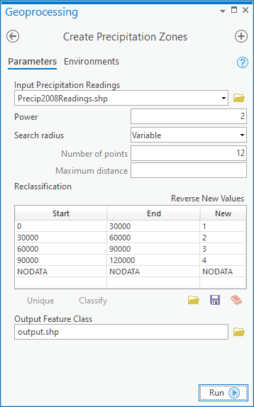
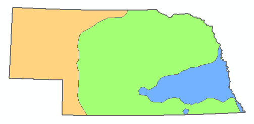

```{r setup, include=FALSE}
knitr::opts_chunk$set(echo = TRUE)
```

# Lab 01: Python fundamentals and geoprocessing in ArcGIS Pro

### Read the instructions COMPLETELY before starting the lab

## Part 1: Python fundamentals

The purpose of part 1 is to (re-)introduce you to basic Python functionality and to demonstrate functions that we don't cover in class. Because students have varying levels of experience with Python, I have provided the lab exercise from your textbook as a refresher. This file is named *"PythonScripting_Ex04.pdf"*. You may complete as much or as little of the exercises as you like, depending on your experience and comfort with Python. This lab assumes you have read Chapter 4 from your textbook. For Part 1, you may use whatever editor/interpreter you wish (e.g., Jupyter, Spyder, IDLE)

### For part 1, you must write and turn in script(s) that complete the following tasks:

1. Extracts the sub-string "GIScience" from the String "Learning GIScience is awesome!"

2. Uses a loop control structure to count from 0-100 by fives. The script should print the value to the console AND should print whether the value is odd or even. For example, an output could look like "15 is odd"

3. Calculates and prints (with meaningful statements) the sum, median, and mean of the array [7, 24.5, 99, 101, 256, 128, 1000]. You must use array references or other functions in the math - do NOT directly use the numeric values in the calculation. The code should be general enough to perform the calculations for any given array. Test the same code using the array [1, 2, 3, 4, 5]. Show both results.

4. Reads the "lab01textsample.txt" file, assigns it to a variable, and then prints the file line-by-line. Extra points if you can skip printing the first 2 lines.

5. Write a function that accepts as a parameter a numeric value corresponding to the **percentage score** for the class and and returns the corresponding letter grade for the course. It must also return an appropriate message for scores outside of the correct range of scores. You don't have to bother with pluses or minuses, just full letter grades. Finally, test your function and show that it works for the scores: -5, 45, 70, 99, and 125.

\newpage

## Part 2: Modeling precipitation zones in Nebraska in ArcGIS Pro

Suppose you're working on a project for the Nebraska Department of Agriculture and you are tasked with making some maps of precipitation in the state. Members of the department want to see which parts of the state were relatively dry and wet in the past year, classified in zones. All you have is a series of weather station readings of cumulative rainfall for 2008 that you've obtained from within Nebraska and surrounding areas. This is a shapefile of points called Precip2008Readings.shp. It is in your lab01 data folder.

Precip2008Readings.shp is a fictional dataset created for this project. The locations do not correspond to actual weather stations. However, the measurements are derived from real 2018 precipitation data created by the PRISM Climate Group at Oregon State University, 2019.

You need to do several tasks in order to get this data ready for mapping:

- Interpolate a precipitation surface from your points. This creates a raster dataset with estimated precipitation values for your entire area of interest. You've already planned for this, knowing that you are going to use inverse distance weighted (IDW) interpolation. Click the following link to learn how the IDW technique works.

[https://pro.arcgis.com/en/pro-app/latest/tool-reference/3d-analyst/how-idw-works.htm](https://pro.arcgis.com/en/pro-app/latest/tool-reference/3d-analyst/how-idw-works.htm)

You've also selected your points to include some areas around Nebraska to avoid edge effects in the interpolation.

- Reclassify the interpolated surface into an ordinal classification of precipitation "zones" that delineate relatively dry, medium, and wet regions.

- Create vector polygons from the zones.

- Clip the zone polygons to the boundary of Nebraska.


It's very possible that you'll want to repeat the above process in order to test different IDW interpolation parameters or make similar maps with other datasets (such as next year's precipitation data). Therefore, the above series of tasks is well-suited to ModelBuilder. Your job is to create a model that can complete the above series of steps without you having to manually open four different tools.


Model parameters
Your model should have these (and only these) parameters:

1. Input precipitation readings- This is the location of your precipitation readings point data. This is a model parameter so that the model can be easily re-run with other datasets.

2. Power- An IDW setting specifying how quickly influence of surrounding points decreases as you move away from the point to be interpolated.

3. Search radius- An IDW setting determining how many surrounding points are included in the interpolation of a point. The search radius can be fixed at a certain distance, including whatever number of points happen to fall within, or its distance can vary in order for it to always include a minimum number of points. When you use ModelBuilder, you don't have to set up any of these choices; ModelBuilder does it for you when you set the Search Radius as a model parameter.

4. Zone boundaries- This is a table allowing the user of the model to specify the zone boundaries. For example, you could configure precipitation values of 0 - 30000 to result in a reclassification of 1 (to correspond with Zone 1), 30000 - 60000 could result in a classification of 2 (to correspond with Zone 2), and so on. The way to get this table is to make a variable from the Reclassification parameter of the Reclassify tool and set it as a model parameter.

5. Output precipitation zones- This is the location where you want the output dataset of clipped vector zones to be placed on disk.

As you build your model, you will need to configure some settings that will not be exposed as parameters. These include the clip feature, which is the state of Nebraska outline Nebraska.shp in your lab01 data folder. There are many other settings such as "Z Value field" and "Input barrier polyline features" (for IDW) or "Reclass field" (for Reclassify) that should not be exposed as parameters. You should just set these values once when you build your model. If you ever ask someone else to run this model, you don't want them to be overwhelmed with choices stemming from every tool in the model; you should just expose the essential things they might want to change.

For this particular model, you should assume that any input dataset will conform to the same schema as your Precip2008Readings.shp feature class. For example, an analyst should be able to submit a similar Precip2009Readings dataset with the same fields, field names, and data types. However, he or she should not expect to provide any feature class with a different set of fields and field names, etc. As you might discover, handling all types of feature class schemas would make your model more complex than we want for this assignment.

When you double-click the model to run it, the interface should look like the following:



Running the model with the exact parameters listed above should result in the following (the zones have been symbolized with different colors to help distinguish them). This is one way you can check your work:



### Tips

The following tips may help you as you build your model:

- Your model needs to include the following tools in this order: IDW (from the Spatial Analyst toolbox), Reclassify, Raster to Polygon, Clip (from the Analysis toolbox).

- An easy way to find the tools you need in Pro is to go to Analysis > Tools, then type the name of the tool you want in the search box. Be careful when multiple tools have the same name. You'll typically be using tools from the Spatial Analyst toolbox in this assignment.

- Once you drag and drop a tool onto the ModelBuilder canvas, double-click it and set all the parameters the way you want. These will be the default settings for your model.

- If there is a certain parameter for a tool that you want to expose as a model parameter, right-click the tool in the ModelBuilder canvas, then click Create Variable > From Parameter and choose the parameter. Once the oval appears for the variable, right-click it and click Parameter.

\newpage
## What to turn in:

- Part 1: Scripts that successfully complete the tasks enumerated above

- Part 2: 
  1. A screenshot of your completed model layout
  2. A screenshot of the dialog box that pops up when you run your model (like Figure 2 above)
  3. An exported map of our model output
  
**Answers to the following questions**:

1. What specific skills, functions, or other knowledge did you learn in achieving task 1? What did you find particularly challenging, if anything?

2. In task 1.5, you completed a function that encapsulated a portion of your code. In what context can writing simple functions be helpful?

3. How does IDW work? How do the parameters you set affect the function?

4. What constraints would you need to put on *other* datasets such that they would work with your model?

5. What new skills, functions, or other knowledge did you learn in achieving task 2? What did you find particularly challenging, if anything?


