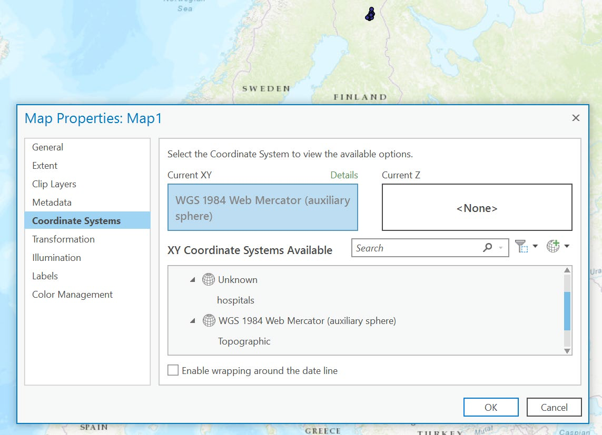
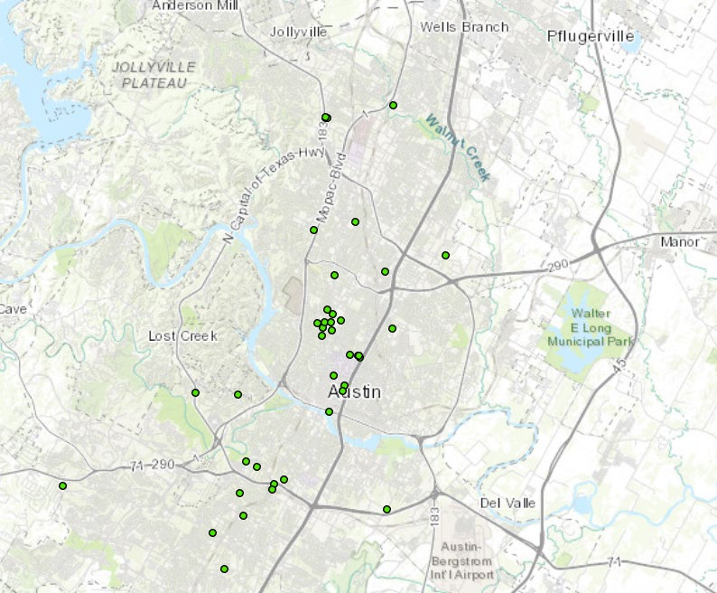

```{r setup, include=FALSE}
knitr::opts_chunk$set(echo = TRUE)
```

# Lab 02: Geoprocessing in ArcGIS Pro

### Read the instructions COMPLETELY before starting the lab

## Part 1: An example of geoprocessing using Python (and some ArcGIS Pro)

Part 1 will familiarize you with some functions we have discussed by not yet used in class. 

1. Download and extract the ```lab02data.zip``` file from the course GitHub respository to a sensible location on your computer. For the purposes of these examples, I will assume your workspace is setup as:

```{code}
arcpy.env.workspace = "C://GEOG432//lab02//"
```

However, you may use whatever workspace location you choose.

1. Run the following code:

```{code} 
arcpy.Exists("hospitals.shp")
``` 
The result is True.

The **Exists()** function returns a Boolean value. Several other ArcPy functions also are not geoprocessing tools, and some of them are used later in this exercise and others.

The **Usage()** function is a useful shortcut for getting the syntax of ArcPy functions without relying on the pop-ups in the Python windows.

2. Run the following code:

```{code} 
arcpy.Usage("Clip_analysis")
```

The result is

```{code} 
'Clip_analysis(in_features, clip_features, out_feature_class, {cluster_tolerance})'
```

Remember to use a toolbox alias to call geoprocessing tools. Calling a tool by name only will produce an error. 

3. Run the following code:

```{code} 
arcpy.Usage("Clip")
```

The result is

'Method Clip not found. Choices: Method Clip not found.'

The Usage function applies to all ArcPy functions, not only to geoprocessing tools.

4. Run the following code:

```{code} 
arcpy.Usage("Exists")
```

The result is

'exists(<dataset>, {datatype}) -> boolean Check if a data element exists.'

In addition to functions, ArcPy also contains several classes. Classes are often used as shortcuts to complete tool parameters. You already have become familiar with using the env class to set environment properties. Another commonly used class is the SpatialReference class.

5. In ArcGIS Pro, add hospitals.shp to a new map.

The spatial reference of this shapefile is missing. As a result, the hospitals show up in northern Finland instead of Austin, Texas. This happens because the coordinates are displayed in the default Web Mercator coordinate system.



You will use the Define Projection tool to fix it. The syntax of the Define Projection tool is as follows:

```{code} 
DefineProjection_management(in_dataset, coor_system)
```

6. Run the following code:
(note, your files may be in a different location)

```{code} 
prjfile = "C:\\GEOG432\\lab02\\facilities.prj"

spatial_ref = arcpy.SpatialReference(prjfile)
```

This spatial reference object can now be used for other purposes.

7. Run the following code:

```{code} 
arcpy.DefineProjection_management("hospitals", spatial_ref) 
```

The result is: **<Result 'hospitals'>**

The SpatialReference object is used in the Define Projection tool to specify the coordinate system of the hospitals.shp file. In this example, the coordinate system parameter also could be specified by directly referencing the .prj file as a parameter of the Define Projection tool. However, creating a spatial reference object also gives you access to its many properties.

8. Run the following code:

```{code} 
print(spatial_ref.name)
```

The result is

**NAD_1983_StatePlane_Texas_Central_FIPS_4203_Feet.**

9. Run the following code:

```{code} 
print(spatial_ref.linearUnitName)
```

The result is

Foot_US.

10. Run the following code:

```{code}
print(spatial_ref.XYResolution)
```
The result is

0.000328083333333.

The result of running the Define Project tool is that the feature class hospitals.shp is assigned the correct coordinate system.

11. Right-click on the hospitals data layer in the Content panel of the active map, and click Zoom To Layer.

The hospitals are now showing where they belong—i.e., in Austin, Texas.



\newpage
## Part 2: Some simple analysis on your own

Often when we produce analysis, we rely on other tools (e.g., data visualization, statistical software) **in addition to** our geoprocessing workflows. For this part of the lab, you will be tasked to complete  a simple analysis of distance in Vermont. 

### Your data:

- vt_munis.shp: a feature class that contains all of the Vermont municipalities (i.e., towns, cities, and villages) that intersect the Lake Champlain Basin

- lake_champlain.shp: a feature class of Lake Champlain

### Your tasks:

1. Write a Python script (using arcpy) that calculates the distance FROM ALL municipalities TO Lake Champlain
2. Create a map (using the ArcGIS Pro GUI) that symbolizes that distance in a meaningful way. This will serve as a quick check that you have successfully calculated distance
3. Produce a histogram that plots the distribution of distance values. You may use any tool you like (e.g., R, Excel, something from the web)
4. Using arcpy, reproject the *vt_munis* feature class (whatever projection you wish), **then recalculate distance(s) to Lake Champlain**
5. Finally, **for each municipality**, calculate the *differences* between the 2 distances and report using summary statistics (mean, median, standard deviation)
6. Answer the questions below

\newpage
## Part 3: building a model with Python
 
In lab 1 (part 2), you completed the following:

1. Interpolated a precipitation surface from your points
2. Reclassifed the interpolated surface into an ordinal classification of precipitation "zones" that delineate relatively dry, medium, and wet regions
3. Created vector polygons from the zones
4. Clippe the zone polygons to the boundary of Nebraska

### Today's task: replicate the workflow in a Python script

1. Replicate the workflow using Python (and arcPy) ONLY!
2. Then, export your model from Lab 1 as a Python Script
3. Compare the model-generated code to what you wrote. Answer the questions below:

\newpage

## Questions:

### Part 2:

1. How is distance defined in your calculation?
2. What control do you have over the distance calculation?
3. How might alternative conceptualizations of "distance" affect the analysis? (note, for this question I am NOT referring to differences in projection or CRS)
4. What coordinate reference system (CRS) was vt_munis originally in? What CRS did you change it to?
5. How did the calculation of distance change after you reprojected?

### Part 3:

6. What challenges did you encounter in writing your script to accomplish the task? How did you overcome them?
7. How did the model-generated code differ to what you wrote? Would you now do anything differently? (note, just because it was created by ArcGIS Pro, doesn't mean it's the absolute best way to accomplish the task)


## What to turn in:
- Answers to the questions above
- Map from part 2
- Histogram from part 2
- Summary statistics from part 2
- Script from part 2
- Script from part 3