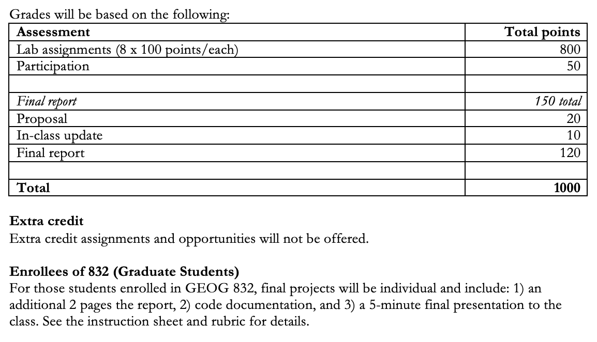

# GEOG 432/832: Programming, Scripting, and Automation for GIS

## 

## Week 01.01: Course intro

### Dr. Bitterman

## 

---

# Today's schedule

- Course welcome
- Introductions
- Syllabus and course basics
- Exercises
- For next class

---

### But first, anything to discuss?

---

# My approach to this course

- Geography matters
- Concepts and independent thinking are important, trivia is not (or at least not always)
- It's important to solve problems or complete tasks, but understanding *HOW* you do is more important

---

# Class introductions

- Pair up - don't leave anyone behind
- Share:
  - Name
  - Where you're from
  - Major/program, year
  - Why you're taking the course?
  - Previous GIS experience
  - Previous programming experience
  - Imagine it's December 2023 - what would make you feel like you were successful in this course? *(save this one somewhere)*

---

# My introduction

- Dr. Patrick Bitterman
- Independence, IA -> U Iowa -> UVM -> UNL
- Assistant Professor in Geography
- Goals: teach a successful course, build research program, curriculum
- GIS experience? Programming experience? 
- Success in this course? Students: 
  - reach their learning objectives
  - are able to use scripting and programming tools to make their work faster and more consistent
  - improve methods related to their other research or career interests


---

# Share

- Present your partner to the class

- Who wants to go first?

---

# Questions?

---

# Course basics

---

# Instructor (me)

- Dr. Patrick Bitterman
- Geography Program, in School of Global Integrative Studies

## 

- Office: 930 Oldfather Hall
- Office hours: Tuesdays 2 – 4pm, or by appointment (in-person or Zoom)
- Email: patrick.bitterman@unl.edu
- Web: http://www.patrickbitterman.com

---

# If you have issues with me or this course

- I hope you feel comfortable talking to me first
  - After class
  - Office hours

## 

- But if not, contact:
  - Dr. Sophia Perdikaris
   - Office: 816A Oldfather Hall
   - Email: sperdikaris2@unl.edu


---

# Materials

- Required
  - Zandbergen, P. A. 2020. Python Scripting for ArcGIS Pro. Esri Press.
  - Buy it used if you can

- Suggested materials
  - Gries, P., Campbell, J., and Montojo, J. (2013). Practical Programming: An Introduction to Computer Science Using Python, Pragmatic Programmers. (if you are unfamiliar with Python or other programming languages)

- Everything else on Canvas


---

# Learning objectives

### By the end of the term, students will be able to successfully:
- Demonstrate a familiarity with different programming languages commonly used in GIS automation and geospatial analysis (Python)
- Perform object-oriented programming tasks in Python
- Analyze model workflows and describe computer code and algorithms in plain language
- Create small-scale programs that interface with ArcGIS
- Practice good programming practices
- Plan, develop, and execute a programmatic analysis of a dataset

---

# Assignment submission
- All assignments due on their due date
- All assignments will be posted on Canvas
- Late items will be accepted, but will be penalized 20% of the potential points for each day they are late
- All changes to the syllabus will be communicated via Canvas announcement
- Students are expected to attend all class meetings, but attendance is not graded


---

# Collaboration
- Feel free to discuss labs, etc. with your classmates
- However…
  - All lab reports, papers, and other work should be your own, individual thoughts
  - Students who do not follow these policies will be reported to the College for academic dishonesty

---

# Miscellany

- Be honest and have integrity in your work
- Be kind and be polite
- Be respectful – don’t be disruptive
- You will get out of this class what you put into it – come prepared, participate, and be attentive, and you will be successful

---


---

# Other tips

- Read relevant materials before class
- Attend class – understanding theory and concepts will help you with practical applications
- If there are topics, news stories, blog posts, tweets, etc. that you find interesting or want to know more about, let me know
- **Before you start coding**, think through the process and sketch out the workflow. This is called pseudocode
- Labs build on each other, so don’t get behind
- Take advantage of office hours
- Do not leave assignments until the last minute
- Have fun!


---

# Assessment
## (always, always, always look on Canvas)

### Lab assignments
- 8 labs, 1-2 weeks to complete each one

### Project/report (details to come)
- Proposal
- Update presentation (in-class)
- Final paper

### Participation

---

# Assignments will be submitted through a mix of Canvas + GitHub

### Create a github.com account if you do not already have one


---

# Grading (see syllabus for evaluation scale)




---

# Course schedule (two parts)


### Part 1: Python with ArcGIS Pro
1. Course intro, intro to Python, environments
2. Pythnog fundamentals and geoprocessing in ArcGIS Pro
3. Geoprocessing in Python
4. Geoprocessing in Python
5. Exploring spatial data
6. Spatial and tabular data
7. Geometries
8. Rasters

---

# Course schedule (two parts)


### Part 2: Open-source tools and SDA (after fall break)


10. Python data science, open data, and Jupyter
11. Spatial data and mapping
12. Spatial weights
13. ESDA and spatial autocorrelation
14. Thanksgiving
15. Clustering and point-pattern analysis
16. Presentation


---

# Course format

- Project-based
- Student-led
  - I am not going to recap the readings (much)
  - You are expected to be ready to participate in discussion
  - We will spend most of our time doing, not lecturing

- Tuesdays: discussion, examples, and activities
- Thursdays: some activities, mostly workdays (labs, projects)

---

# Course inspirations and sources

- Textbook
- My own experience
- GEOG 485: GIS Programming and Software Development (PSU) https://www.e-education.psu.edu/geog485/node/91 
- ENVS 363/563: Geographic data science (U Liverpool) https://darribas.org/gds_course/content/home.html 


---

# University policies
- Learning accommodations
  - Contact Services for Students with Disabilities
  - Let me know
- Academic integrity
  - Don’t cheat
  - Don’t plagiarize 
- Health and safety
  - Counseling and Psychological & Services (CAPS)
  - Big Red Resilience & Well-being

---

# Questions?

---


# Let's talk about why we're here


---


---


**Prompt**: write a python script reads a shapefile and determines what type of spatial feature it is (e.g., line, point, or polygon)

```
import geopandas as gpd

def determine_shapefile_type(shapefile_path):
    # Read the shapefile using geopandas
    gdf = gpd.read_file(shapefile_path)
    
    # Check the first geometry to determine type, assuming the shapefile is consistent
    geometry_type = gdf['geometry'][0].geom_type
    
    # Print the type of spatial feature
    if geometry_type == 'Point':
        print("The shapefile contains point features.")
    elif geometry_type == 'LineString' or geometry_type == 'MultiLineString':
        print("The shapefile contains line features.")
    elif geometry_type == 'Polygon' or geometry_type == 'MultiPolygon':
        print("The shapefile contains polygon features.")
    else:
        print(f"The shapefile contains {geometry_type} features, which is not a standard type.")

# Test the function
shapefile_path = "path_to_your_shapefile.shp"
determine_shapefile_type(shapefile_path)

```

---

# Some motivation
 
https://www.youtube.com/watch?v=hMloyp6NI4E

---


# Let’s look at (and talk about) some code

---

# Why Python?

- “Simple”
- FOSS (free, open-source software)
- Cross-platform
- Functional
- Object-oriented
- ***Integrates with ArcGIS Pro***


---

# Scripting vs programming

- What's the difference?
- Which are we going to do? Mostly scripting, some of both.
  - First half
  - Second half


---

# Consider the scenario (Zandbergen 1.7)

- you have several shapefiles in a directory
- you must copy those shapefiles to a new feature dataset inside a file geodatabase
- In addition, you want to copy **only the polygon shapefiles**


---

# What steps do we need to follow?

---

* Establish the desired database structure
  * Create File Geodatabase and 
  * Create Feature Dataset
* Copy the shapefiles… options:
  * Feature Class to Feature Class
  * Feature Class to Geodatabase
  * Copy Features

* In ArcGIS Pro, you typically must run these tools for every shapefile you want to copy
* The Feature Class to Geodatabase tool allows you to use multiple shapefiles as input features, but they must be selected manually in the tool dialog box
* Not difficult, but time consuming… what if you had 100 or more shapefiles to copy? 
* Running the tools 100 times would be cumbersome and **prone to errors.** This is where automation can be helpful


---

# As code


---
# Example 2: points on a line
- Feature class containing one or more polylines. 
- **Task:** create new points placed along each polyline at regularly spaced intervals
- Why might we want to do this? Any ideas?


---

# Let’s break it down… how will we do it?

* Read the geometry of each feature 
* Create new points 
  * Properties of the geometry relative to the interval
* Anything else we need?


---


---


# Programming in Python

- What have you used before?
- We're going to talk about (and maybe use) 3 main interpreters:
  - IDLE
  - Spyder
  - Jupyter notebooks (both in and out of ArcPro)
- First, open ArcGIS Pro
  - You'll have to setup the license server the first time you login to a machine
  - Find instructions on the Canvas page
- Find IDLE in your start menu, open it (we'll talk about it)
- Next, launch Anaconda --> Jupyter notebooks (we'll talk about it too)
- Finally, launch Spyder (in Anaconda) (we'll talk some more)

---

# Some day-one basics

---

# What is a variable?
Time to practice. We’ll start by looking at variables.

- From algebra: a letter can represent any number, like in ```x + 2```
- In computer science, variables represent *values* or *objects* we want the computer to store in its memory for later use

- Variables don't only represent numbers
  - ...but also text and Boolean values (‘true’ or ‘false’)
  - input from the program’s user
  - to store values returned from another program
  - to represent constants
  - etc.
  
---

# Why use variables?

- Variables make your code readable and flexible
- Hard-coded values (also called "magic numbers") mean your code is useful only in one particular scenario
- You can manually change the values in your code to fit a different scenario
  - tedious
  - greater risk of making a mistake
- Variables allow your code to be useful in many scenarios and are easy to *parameterize*, meaning you can let users change the values

---

# Let's write some (basic) code

- **Open** Jupyter Notebook (not Jupyter Lab) in Anaconda 
- Create (or find) a working directory
- Create a new notebook, name it something sensible

In the first cell, type the following, then press *Enter:*

```python
x = 5
```

### *What happened?* ...anything?

...let's try **Shift + Enter** 

---

# What happened?

You’ve declared a variable *x* and set its value to `5`
In some programming languages (e.g., Java), you're required to tell the interpreter what the *type* of the variable is. ***Not in Python.***

When you executed the last command, nothing *appeared* to happen, but the program now has stored this variable in memory. To prove this, type:

```python
x + 3
```


*What happened?*

You can also print. Try:

```python
print(x + 3)
```

We'll use the print function a lot when we're testing code

---

# Some Strings

Variables can also represent words, or *strings* of characters. Try this:

```python
ourTeam = "Huskers" #or "Hawkeyes", or whatever your team is :)
print(ourTeam)
```

- Here, the quotation marks tell Python that you are declaring a string variable
- Python is a powerful language for working with strings
- A simple example of string manipulation is to add, or concatenate, two strings:

```python
string1 = "Go "
string2 = "Big "
string3 = "Red!"
print(string1 + string2 + string3)
```

TRY IT!
*Did you get the spacing right?*


---

# More Strings

- You **can** include a number in a string variable by putting it in quotes...
- but you must thereafter treat it like a *string*, NOT a number
- For example, this results in an error:

```python
myValue = "5"
print(myValue + 3)
```

*Try it, what happens?*

---

# Tips for naming variables

- Variable names are case sensitive. ```myVariable``` is a different variable than ```MyVariable```.
- Variable names cannot contain spaces
- Variable names cannot begin with a number
- Recommended practice for Python variables 
  - name the variable beginning with a lower-case letter
  - then begin each subsequent word with a capital letter
  - called "camel case"
  - For example: myVariable, mySecondVariable, roadsTable, bufferField1, etc.
- Variables cannot be reserved words such as "import" or "print"
- *Make variable names meaningful so that others can easily read your code. This will also help you read your code and avoid making mistakes*

---
# What can variables represent?

- number and string variables we worked with above represent data types that are built into Python
- Variables can also represent other things:
  - GIS datasets
  - tables
  - rows
  - a geoprocessor that can run tools
- All of these things are objects that you use when you work with ArcGIS in Python


--- 


# Take away points

- ArcGIS Pro supports the use of scripting to automate workflows
- Python is the preferred scripting language for working with ArcGIS Pro
- Python: 
  - open-source programming language
  - …is easy to use
  - large user community
  - a scripting language and a programming language
  - interpreted language, does not need to be compiled
- ArcGIS Pro works with Python 3
- One of the best ways learn is to look at the work of others…
- But don’t steal/plagiarize 


---

# For next class

- Any questions on course policies?
- On anything else?
- This week’s readings: 
  - Chapters 1 & 2 in textbook
- Lab 1 will start next week
