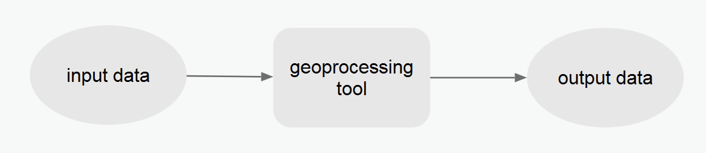
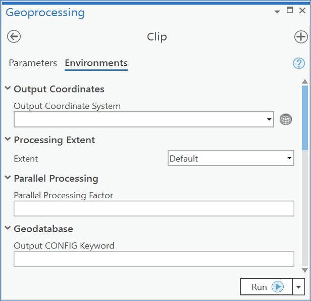
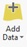

# GEOG 432/832: Programming, Scripting, and Automation for GIS

#

## Week 02.01: Geoprocessing in ArcGIS Pro

### Dr. Bitterman

#

--- 

# Today's schedule

- Open discussion
- Geoprocessing workflows and examples

---

# Open discussion

---

# Geoprocessing

## What is geoprocessing?

A process

- to perform spatial analysis and modeling
- automate GIS tasks

A typical geoprocessing tool:
1. takes input data (a feature class, raster, or table)
2. performs a geoprocessing task
3. produces output data as a result

---

# loads o' tools

ArcGIS Pro contains > 1000 geoprocessing tools
Examples:
- buffer
- adding a field to a table
- geocoding a table of addresses

### General schematic



---

# Invoking geoprocessing

## Options:
1. Work with the ArcGIS Pro GUI
2. Use the GUI to batch tasks
3. Create your own workflow or tool *(what's the difference)* with **ModelBuilder**
4. Use Python

---

# Let's start with the GUI

*Why are we starting with the GUI?*

- A refresher (or new intro) to ArcPro tools
- Helps us understand how each tool works
- Visualization is useful when we're starting out
- Can expose underlying frameworks for processing, batching, and automating tasks

---

# Exploring ArcGIS Pro tools

1. Open ArcGIS Pro, and create a new project
2. Is the Geoprocessing pane visible? (if not -> Analysis tab -> tools)
3. In the Geoprocessing pane, click the Toolboxes tab heading.
    1. Tools are organized into toolboxes and toolsets
    2. Your can also search (often faster)
4. Let’s look at a tool. Expand Analysis Tools > Proximity > Buffer, and double-click the Buffer tool to open it.

---

# Exploring continued (the Buffer tool)

### What do you see?
Dialog with many, many fields

- Each tool has required inputs and outputs (red asterisks)
- What's required by the Buffer tool?
    - input features location (the features that will be buffered) 
    - buffer distance
    - output feature class location (for the new buffered features)

- Optional parameters
    - You can specify
    - or run with defults... you should always, always understand the defaults
    - **What are the optional parameters for the Buffer tool?**

---

# Looking at parameters

5. Hover your mouse over any of the tool parameters.  What do you see?
    - Move your mouse over the blue icon for a brief description
    - A very good way to learn... 
    - You can access a tool's documentation by clicking on the blue ```?``` icon in the upper-right of the tool dialog

6. Open the web-based help page for the Buffer tool - what do you see?

7. Click the *Code Sample* link to jump to that section. Each tool's help page has programming examples showing how to automatically run the tool in Python. Useful!!!

---

# Environments are always at work

- Environments can be specified at several levels, and there is a specific hierarchy to this process:
    - The first level is the application. On the Analysis tab, click Environments to bring up the Environments dialog box. Any settings created here are passed to the geoprocessing tools that are called by the application.
    - The second level is the individual tool. Every tool dialog box has an Environments tab. When you click this tab, only those environments that are relevant for the tool are shown. Any settings created here are applied only to the current running of the tool, and these settings temporarily override the settings passed by the application from the Environments dialog box.
    
### These settings are not saved to the tool but apply only to a single execution of the tool

---



---

# Let's run a tool from the GUI

---

# Using the GUI

1. Create a new directory on your local machine (we're not going to keep the data, so wherever is convenient)
2. Download the ```week02inclass.zip``` data from Canvas, extract it to the directory you just created
3. Open a new project in ArcGIS Pro (if not already open)
4. Click the Add Data button , navigate to the data, then add **us_boundaries** and **us_cities** shapefiles to the project

---

# Running a tool

1. Double-click the Buffer tool
2. Examine the first required parameter: Input Features. 
3. Choose the cities dataset 
4. Now you need to supply the Distance parameter for the buffer - let's go with ```10``` miles
4. The rest of the parameters are optional
    1. **Side Type**: applies only to lines and polygons
    2. Change **Dissolve Type** to ```Dissolve all``` output features into a single feature - *what does this do*?
    3. Leave the **Method** set to ```Planar```.  What would happen if we changed it? How would you find out?
5. Click **Run** to execute the tool

---

# Results

### What happened?

- Runtime is a function of dataset size, tool complexity, and your computering environment
- In this case, ```Buffer``` should take a few seconds to execute
- Examine the output that appears on the map, and check the data to ensure that 1) buffers appear around the cities and, 2) they appear to be about 10 miles in ``radius`` 

- Click on Pro's Analysis tab, then on History 
- Hover over the Buffer tool entry in this list to see a pop-out window
    - This window lists the tool parameters 
    - The time of completion
    - and any problems that occurred when running the tool (not always helpful)

---

# Modeling with tools

- When geoprocessing, you’ll often want to use the **output** of one tool as the **input** to another tool
- For example, suppose you want to find all homes within 500 meters of a river... 
- *One way of completing the task:*
    - first buffer the river
    - then use the output buffer as a spatial constraint for selecting homes
    - the output from the Buffer tool used as an input to the Select by Location tool

- A chain of tools (or a "toolchain") is called a **model**. 
- Models can be simple, highly complex, or anywhere in-between
- Benefit(s): models solve a problem that cannot be addressed by one of the “out-of-the-box” tools from ESRI (or elsewhere)

---

# For next class

This week's readings
- Chapters 3 & 4

Lab 1 starts Friday

