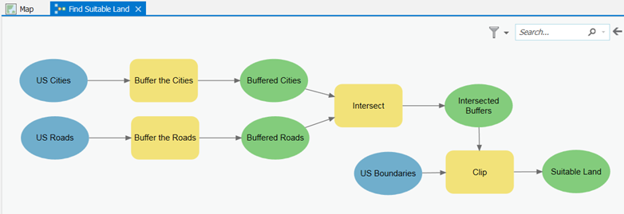
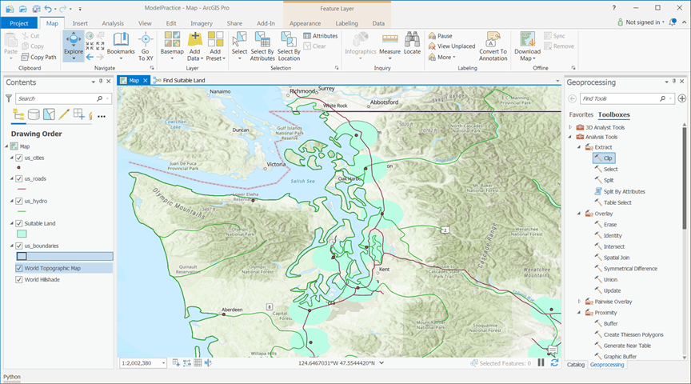

# GEOG 432/832: Programming, Scripting, and Automation for GIS

#

## Week 02.01: Geoprocessing in ArcGIS Pro

### Dr. Bitterman

#

--- 

# Today's schedule

- Open discussion
- Geoprocessing workflows and examples
- ModelBuilder exercise

---

# Open discussion

---

# Geoprocessing

## What is geoprocessing?

A process

- to perform spatial analysis and modeling
- automate GIS tasks

A typical geoprocessing tool:
1. takes input data (a feature class, raster, or table)
2. performs a geoprocessing task
3. produces output data as a result

---

# loads o' tools

ArcGIS Pro contains > 1000 geoprocessing tools
Examples:
- buffer
- adding a field to a table
- geocoding a table of addresses

### General schematic


---

# Invoking geoprocessing

## Options:
1. Work with the ArcGIS Pro GUI
2. Use the GUI to batch tasks
3. Create your own workflow or tool *(what's the difference)* with **ModelBuilder**
4. Use Python

---

# Let's start with the GUI

*Why are we starting with the GUI?*

- A refresher (or new intro) to ArcPro tools
- Helps us understand how each tool works
- Visualization is useful when we're starting out
- Can expose underlying frameworks for processing, batching, and automating tasks

---

# Exploring ArcGIS Pro tools

1. Open ArcGIS Pro, and create a new project
2. Is the Geoprocessing pane visible? (if not -> Analysis tab -> tools)
3. In the Geoprocessing pane, click the Toolboxes tab heading.
    1. Tools are organized into toolboxes and toolsets
    2. You can also search (often faster)
4. Let’s look at a tool. Expand Analysis Tools > Proximity > Buffer, and double-click the Buffer tool to open it.

---

# Exploring continued (the Buffer tool)

### What do you see?
Dialog with many, many fields

- Each tool has required inputs and outputs (red asterisks)
- What's required by the Buffer tool?
    - input features location (the features that will be buffered) 
    - buffer distance
    - output feature class location (for the new buffered features)

- Optional parameters
    - You can specify
    - or run with defults... you should always, always understand the defaults
    - **What are the optional parameters for the Buffer tool?**

---

# Looking at parameters

5. Hover your mouse over any of the tool parameters.  What do you see?
    - Move your mouse over the blue icon for a brief description
    - A very good way to learn... 
    - You can access a tool's documentation by clicking on the blue ```?``` icon in the upper-right of the tool dialog

6. Open the web-based help page for the Buffer tool - what do you see?

7. Click the *Code Sample* link to jump to that section. Each tool's help page has programming examples showing how to automatically run the tool in Python. Useful!!!

---

# Environments are always at work

- Environments can be specified at several levels, and there is a specific hierarchy to this process:
    - The first level is the application. On the Analysis tab, click Environments to bring up the Environments dialog box. Any settings created here are passed to the geoprocessing tools that are called by the application.
    - The second level is the individual tool. Every tool dialog box has an Environments tab. When you click this tab, only those environments that are relevant for the tool are shown. Any settings created here are applied only to the current running of the tool, and these settings temporarily override the settings passed by the application from the Environments dialog box.
    
### These settings are not saved to the tool but apply only to a single execution of the tool

---


---

# Let's run a tool from the GUI

---

# Using the GUI

1. Create a new directory on your local machine (we're not going to keep the data, so wherever is convenient)
2. Download the ```week02inclass.zip``` data from the course Github page (https://github.com/pjbitterman/UNL_geog432/blob/main/data/week02inclass.zip), extract it to the directory you just created
3. Open a new project in ArcGIS Pro (if not already open)
4. Click the Add Data button , navigate to the data, then add **us_boundaries** and **us_cities** shapefiles to the project

---

# Running a tool

1. Double-click the Buffer tool
2. Examine the first required parameter: Input Features. 
3. Choose the cities dataset 
4. Now you need to supply the Distance parameter for the buffer - let's go with ```10``` miles
4. The rest of the parameters are optional
    1. **Side Type**: applies only to lines and polygons
    2. Change **Dissolve Type** to ```Dissolve all``` output features into a single feature - *what does this do*?
    3. Leave the **Method** set to ```Planar```.  What would happen if we changed it? How would you find out?
5. Click **Run** to execute the tool

---

# Results

### What happened?

- Runtime is a function of dataset size, tool complexity, and your computering environment
- In this case, ```Buffer``` should take a few seconds to execute
- Examine the output that appears on the map, and check the data to ensure that 1) buffers appear around the cities and, 2) they appear to be about 10 miles in ``radius`` 

- Click on Pro's Analysis tab, then on History 
- Hover over the Buffer tool entry in this list to see a pop-out window
    - This window lists the tool parameters 
    - The time of completion
    - and any problems that occurred when running the tool (not always helpful)

---


# Modeling with tools


---

# Modeling with tools

- When geoprocessing, you’ll often want to use the **output** of one tool as the **input** to another tool
- For example, suppose you want to find all homes within 500 meters of a river... 
- *One way of completing the task:*
    - first buffer the river
    - then use the output buffer as a spatial constraint for selecting homes
    - the output from the Buffer tool used as an input to the Select by Location tool

- A chain of tools (or a "toolchain") is called a **model**. 
- Models can be simple, highly complex, or anywhere in-between
- Benefit(s): models solve a problem that cannot be addressed by one of the “out-of-the-box” tools from ESRI (or elsewhere)

---

# ModelBuilder exercise (paired work)

## The problem:

 Suppose you are working on a site selection problem where you need to select all areas that fall within 10 miles of a major highway and 10 miles of a major city. The selected area cannot lie in the ocean or outside the United States. 
 
 Solving the problem requires that you make buffers around both the roads and the cities, intersect the buffers, then clip to the US outline. Instead of manually opening the **Buffer** tool twice, followed by the **Intersect** tool, then the **Clip** tool, you can set this up in ModelBuilder to run as one process.

---

# Getting started

1. Create a new ArcGIS Pro project called ```Lesson1Practice```
2. Add the us_cities, us_roads, and us_boundaries shapefiles from the ```week02inclass.zip``` file we used before
3. In the Catalog pane, right-click your ```Lesson1Practice ```toolbox and click ```New > Model```.  You’ll see **ModelBuilder** appear in the middle of the Pro window
4. Under the ModelBuilder tab, click the Properties button
5. For the Name, type ```SuitableLand``` and for the Label, type ```Find Suitable Land```
    1. The label is what users will see when they open your tool from the Catalog (That’s why it can contain spaces). 
    2. The name is what users will use when run your model from Python (That’s why it cannot contain spaces)
6. Click ```OK``` to dismiss the model Properties dialog

---

# What do we have?

- We have a blank canvas on which we can drag and drop tools. 
- When creating a model (and when writing Python scripts), it’s best to break your problem into manageable pieces
- Our simple site selection problem  can be thought of as four steps:
    1. Buffer the cities
    2. Buffer the roads
    3. Intersect the buffers
    4. Clip to the US boundary

Let’s tackle these items one at a time


---

# Buffers

1. With ModelBuilder still open, go to the Catalog pane > Geoprocessing tab and browse to Analysis Tools > Proximity

2. Click the Buffer tool and drag it onto the ModelBuilder canvas

*You’ll see a gray rectangular box representing the buffer tool and a gray oval representing the output buffers. These are connected with a line, showing that the Buffer tool will always produce an output data set.*

- Tools are represented with boxes and variables are represented with ovals. The Buffer tool is gray because you have not yet supplied the required parameters. Once you do , the tool and the variable will fill in with color. *It's not the best system*


---

4. In your ModelBuilder window, double-click the Buffer box

5. For Input Features, select the ```us_cities``` shapefile

6. Specify the Output Feature Class 

6. For Distance [value or field], enter ```10``` miles

7. For Dissolve Type, select ```Dissolve all output features...```, then click OK to close the Buffer dialog. 

- The model elements (tools and variables) should be filled in with color, and you should see a new element to the left of the tool representing the input cities feature class

---

It's important to use clear labels for all the elements. **Why?**

In ModelBuilder, right-click the ```us_cities.shp``` element (blue oval, at far left) and click Rename. Name this element "US Cities."

9. Rename the ```Buffer``` tool (yellow-orange box, at center) to “Buffer the cities.”

10. Rename the buffer output element (green oval, at far right) to “Buffered cities.” Your model should look like this: 


---

11. Save your model (ModelBuilder tab > Save) 

## This is the kind of activity where you want to save often!

12. Add  another Buffer tool to your model. 

13. This time, configure the tool so that it buffers the ```us_roads``` shapefile by ``10`` miles. Remember to set the parameters the same as before and to add meaningful labels

Your model should now look like this:


---

## The next task is to intersect the buffers 

14. In the Catalog pane's list of toolboxes, browse to Analysis Tools > Overlay and drag the ```Intersect``` tool onto your model. Position it to the right of your existing Buffer tools

### Here’s where we chain the tools together, setting the outputs of your Buffer tools as the inputs of the Intersect tool.

15. Click the ```Buffered cities``` element and drag over to the ```Intersect``` element. If you see a small menu appear, click Input Features to denote that the buffered cities will act as inputs to the Intersect tool. An arrow will now point from the Buffered cities element to the Intersect element.

16. Use the same process to connect the Buffered roads to the Intersect element. Again, if prompted, click Input Features

---

17. Rename the output of the Intersect operation "Intersected buffers." If the text runs onto multiple lines, you can click and drag the edges of the element to resize it. 

(You can also rearrange the elements on the page however you like. Because models can get large, ModelBuilder contains several navigation buttons for zooming in and zooming to the full extent of the model in the View button group on the ribbon.)  

### Your model should now look approximately like this:


---
# next, we clip the intersected buffers to US borders...

Why? It prevents any of the selected area from falling outside the country or in the ocean

18. In the Catalog pane, browse to Analysis Tools > Extract and drag the ```Clip``` tool into ModelBuilder

19. Set the Intersected buffers as an input to the Clip tool, choosing Input Features when prompted
    - Note the Clip tool is not ready to run (it’s still shown as a gray rectangle)
    - You need to supply the clip features, which is the shape to which the buffers will be clipped

20. In ModelBuilder (not in the Catalog pane), double-click the Clip tool. Set the Clip Features by selecting us_boundaries.shp, then click **OK** to dismiss the dialog. 
    - You’ll notice that a blue oval appeared representing the Clip Features

--- 

21. Set meaningful labels for the remaining tools as shown below 

Below is an example of how you can label and arrange the model elements



--- 

22. Double click the final output element (named "Suitable land" in the image above) and set the path to a "safe" directory (one you have control over). This is where you can expect your model output feature class to be written to disk

23. Right-click Suitable land and click ```Add to display```

24. Save your model again. Save often.


25. Test the model by clicking the Run button. 
    - The geoprocessing message window  will report any errors that may occur
    - The currently-running tool turns red
    - (If the model crashes, try closing ModelBuilder and running the model by double-clicking it from the Catalog pane. You'll get a message that the model has no parameters. This is okay - go ahead and run the model anyway)

---

26. When the model has finished running (it may take a while), examine the output on the map. Zoom into Washington state to verify that the has Clip worked on the coastal areas. The output should look similar to this.



---

# Check out the Python representation of your model

27. Finally, from the ModelBuilder tab, click on Export --> Export to Python file
28. Save the file somewhere you can find it
29. Locate the file, right-click, then open the file in a text editor. 
30. What does the code look like? Can you follow it?

##  Don't double-click the file or you're run it!

---

# That's it! (and it was a lot)

- You can double-click this model anytime in the Catalog pane and run it just as you would a tool.
- If you do this, you’ll notice that the model has no parameters; you can’t change the buffer distance or input features
- Our model is useful for solving this particular site-selection problem with these particular datasets, but it’s not very flexible 

### Why isn't it flexible?


---

# For next class

This week's readings:
- Chapters 3 & 4

Next week's readings:
- Chapter 5

### Lab 1 starts next class

### From your textbook:
- Look closely at batching tools (we won't cover in class)

