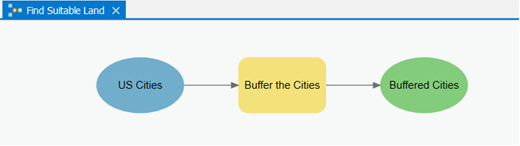
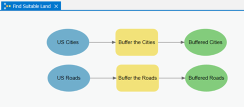
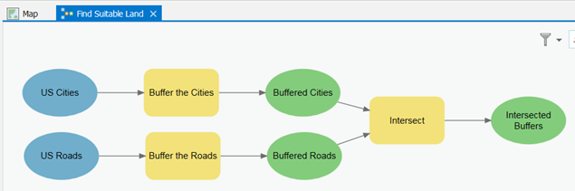
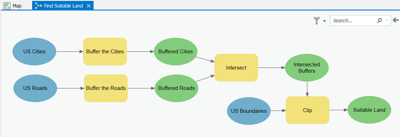
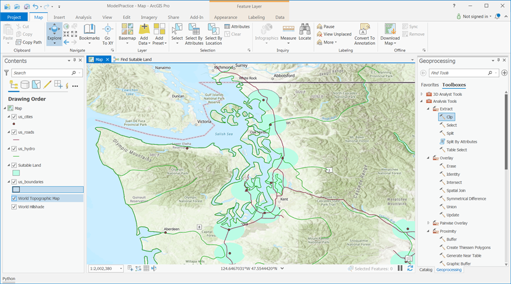

# GEOG 432/832: Programming, Scripting, and Automation for GIS

#

## Week 02.02: Geoprocessing in ArcGIS Pro - ModelBuilder Exercise

### Dr. Bitterman

#

--- 

# Today's schedule

- Open discussion
- Using ModelBuilder

---

# Open discussion

---

# ModelBuilder exercise

## The problem:

 Suppose you are working on a site selection problem where you need to select all areas that fall within 10 miles of a major highway and 10 miles of a major city. The selected area cannot lie in the ocean or outside the United States. 
 
 Solving the problem requires that you make buffers around both the roads and the cities, intersect the buffers, then clip to the US outline. Instead of manually opening the **Buffer** tool twice, followed by the **Intersect** tool, then the **Clip** tool, you can set this up in ModelBuilder to run as one process.

---

# Getting started

1. Create a new Pro project called Lesson1Practice
2. Add the us_cities, us_roads, and us_boundaries shapefiles from the ```week02inclass.zip``` file we used before
3. In the Catalog pane, right-click your Lesson1Practice toolbox and click ```New > Model```.  You’ll see **ModelBuilder** appear in the middle of the Pro window
4. Under the ModelBuilder tab, click the Properties button
5. For the Name, type ```SuitableLand``` and for the Label, type ```Find Suitable Land```
    1. The label is what users will see when they open your tool from the Catalog (That’s why it can contain spaces). 
    2. The name is what users will use when run your model from Python (That’s why it cannot contain spaces)
6. Click ```OK``` to dismiss the model Properties dialog

---

# What do we have?

- We have a blank canvas on which we can drag and drop tools. 
- When creating a model (and when writing Python scripts), it’s best to break your problem into manageable pieces
- Our simple site selection problem  can be thought of as four steps:
    1. Buffer the cities
    2. Buffer the roads
    3. Intersect the buffers
    4. Clip to the US boundary

Let’s tackle these items one at a time


---

# Buffers

1. With ModelBuilder still open, go to the Catalog pane > Geoprocessing tab and browse to Analysis Tools > Proximity

2. Click the Buffer tool and drag it onto the ModelBuilder canvas

*You’ll see a gray rectangular box representing the buffer tool and a gray oval representing the output buffers. These are connected with a line, showing that the Buffer tool will always produce an output data set.*

- Tools are represented with boxes and variables are represented with ovals. The Buffer tool is gray because you have not yet supplied the required parameters. Once you do , the tool and the variable will fill in with color. *It's not the best system*


---

4. In your ModelBuilder window, double-click the Buffer box

5. For Input Features, select the ```us_cities``` shapefile

6. Specify the Output Feature Class 

6. For Distance [value or field], enter ```10``` miles

7. For Dissolve Type, select ```Dissolve all output features...```, then click OK to close the Buffer dialog. 

- The model elements (tools and variables) should be filled in with color, and you should see a new element to the left of the tool representing the input cities feature class

---

It's important to use clear labels for all the elements. **Why?**

In ModelBuilder, right-click the ```us_cities.shp``` element (blue oval, at far left) and click Rename. Name this element "US Cities."

9. Rename the ```Buffer``` tool (yellow-orange box, at center) to “Buffer the cities.”

10. Rename the buffer output element (green oval, at far right) to “Buffered cities.” Your model should look like this: 



---

11. Save your model (ModelBuilder tab > Save) 

## This is the kind of activity where you want to save often!

12. Add  another Buffer tool to your model. 

13. This time, configure the tool so that it buffers the ```us_roads``` shapefile by ``10`` miles. Remember to set the parameters the same as before and to add meaningful labels

Your model should now look like this:



---

## The next task is to intersect the buffers 

14. In the Catalog pane's list of toolboxes, browse to Analysis Tools > Overlay and drag the ```Intersect``` tool onto your model. Position it to the right of your existing Buffer tools

### Here’s where we chain the tools together, setting the outputs of your Buffer tools as the inputs of the Intersect tool.

15. Click the ```Buffered cities``` element and drag over to the ```Intersect``` element. If you see a small menu appear, click Input Features to denote that the buffered cities will act as inputs to the Intersect tool. An arrow will now point from the Buffered cities element to the Intersect element.

16. Use the same process to connect the Buffered roads to the Intersect element. Again, if prompted, click Input Features

---

17. Rename the output of the Intersect operation "Intersected buffers." If the text runs onto multiple lines, you can click and drag the edges of the element to resize it. 

(You can also rearrange the elements on the page however you like. Because models can get large, ModelBuilder contains several navigation buttons for zooming in and zooming to the full extent of the model in the View button group on the ribbon.)  

### Your model should now look approximately like this:




---
# next, we clip the intersected buffers to US borders...

Why? It prevents any of the selected area from falling outside the country or in the ocean

18. In the Catalog pane, browse to Analysis Tools > Extract and drag the ```Clip``` tool into ModelBuilder

19. Set the Intersected buffers as an input to the Clip tool, choosing Input Features when prompted
    - Note the Clip tool is not ready to run (it’s still shown as a gray rectangle)
    - You need to supply the clip features, which is the shape to which the buffers will be clipped

20. In ModelBuilder (not in the Catalog pane), double-click the Clip tool. Set the Clip Features by selecting us_boundaries.shp, then click **OK** to dismiss the dialog. 
    - You’ll notice that a blue oval appeared representing the Clip Features

--- 

21. Set meaningful labels for the remaining tools as shown below 

Below is an example of how you can label and arrange the model elements



--- 

22. Double click the final output element (named "Suitable land" in the image above) and set the path to a "safe" directory (one you have control over). This is where you can expect your model output feature class to be written to disk

23. Right-click Suitable land and click ```Add to display```

24. Save your model again. Save often.


25. Test the model by clicking the Run button. 
    - The geoprocessing message window  will report any errors that may occur
    - The currently-running tool turns red
    - (If the model crashes, try closing ModelBuilder and running the model by double-clicking it from the Catalog pane. You'll get a message that the model has no parameters. This is okay - go ahead and run the model anyway)

---

26. When the model has finished running (it may take a while), examine the output on the map. Zoom into Washington state to verify that the has Clip worked on the coastal areas. The output should look similar to this.



---

# Check out the Python representation of your model

27. Finally, from the ModelBuilder tab, click on Export --> Export to Python file
28. Save the file somewhere you can find it
29. Locate the file, right-click, then open the file in a text editor. 
30. What does the code look like? Can you follow it?

##  Don't double-click the file, or you're run it!

---

# That's it! (and it was a lot)

- You can double-click this model anytime in the Catalog pane and run it just as you would a tool.
- If you do this, you’ll notice that the model has no parameters; you can’t change the buffer distance or input features
- Our model is useful for solving this particular site-selection problem with these particular datasets, but it’s not very flexible 

### Why isn't it flexible?

---

# Recap

This week's readings:
- Chapters 3 & 4

Next week's readings:
- Chapter 5

### Lab 1 starts Friday

### From your textbook:
- Look closely at batching tools (we won't cover in class)
