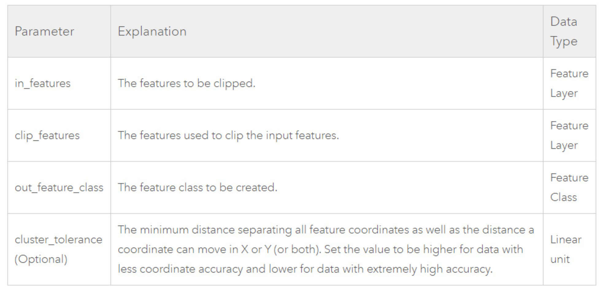

# GEOG 432/832: Programming, Scripting, and Automation for GIS

#

## Week 03.02: More geoprocessing in Python 

### Dr. Bitterman

#

--- 

# Today's schedule

- Open discussion
- Project intro
- Discussion and exercises
- For next class

---

# Open discussion

---

# Finish Monday's exercises

---

# Tools and parameters

- In Python, geoprocessing tools are referred to by name
- Tool name != tool label (but often similar-ish)
- e.g., the name of the **Add Field** tool in the Data Management toolbox is ```AddField``` in ArcPy

###

- references to a tool *also* reaquire the toolbox **alias**... why?
- Multiple tools (in different tool boxes) have the same name 🙄

- Multiple Clip tools
     - Analysis toolbox (i.e., Clip)
     - Data Management toolbox (i.e., Clip Raster, but the name in ArcPy is Clip)
     
- **Further**, the toolbox alias != the name or the label of the toolbox
— e.g., the alias of the Data Management toolbox is “management”

---

# Accessing tools

## Two ways to access a tool in Python/arcpy

### 1. Call its corresponding function

- All geoprocessing tools are available as functions in arcpy
- The syntax for calling a tool by its function is;

```arcpy.<toolname_toolboxalias>(<parameters>)```

For example, the following code runs the Clip tool:

```python
import arcpy
arcpy.env.workspace = "C:/Data"
arcpy.Clip_analysis("streams.shp", "study.shp", "result.shp")
```

---

### 2. Use the modules that match the toolbox alias

The syntax is:

```arcpy.<toolboxalias>.<toolname>(<parameters>)```

For example, *this* code ALSO runs the Clip tool:

```python
import arcpy
arcpy.env.workspace = "C:/Data"
arcpy.analysis.Clip("streams.shp", "study.shp", "result.shp")
```
---

# So, which to use?

- Whichever you want!
- Both are correct, simply a matter of preference

### Reminders:
- Python is case sensitive. "Clip" is correct, "clip" is wrong - you will get an error
- Whitespace matters... until it doesn't
- ```x=3``` is the same as ```x = 3```
- BUT, ```env. workspace``` is incorrect (notice the space)

- Don't include spaces between modules, functions, classes, methods, and properties
- Don't include spaces between functions and their arguments, so 
```<toolname>(<parameters>)``` is **correct**,  ```<toolname> (<parameters>)``` is **wrong**

---

# That said...

From your book...

*Note: The use of extra spaces does not always result in an error, and Python is relatively robust. For example, using env. workspace (with a space in between) does not produce an error, nor does arcpy ```.analysis. Clip()```. In general, however, it is good practice not to add any extra spaces.*

- **Just follow good practices**

### 

- "Official" Python style guide: https://www.python.org/dev/peps/pep-0008/
- Google's guide: https://google.github.io/styleguide/pyguide.html 

---

# Getting the syntax right

- We've used some tools/functions already
- But we've been a bit light on formalization

## Breaking it down

- All geoprocessing tools (and really, most functions in general) have parameters
     - Some are required
     - Others are options

### Can we think of any examples we've seen so far?

### What's a parameter? An argument? How are they different?

---

# Parameters and arguments

- **Parameter:** the variable listed inside the parentheses in the function definition
- **Argument:** the value that are sent to the function when it is called

- Often used interchangably, not the same. *But I'll definitely mispeak and screw it up*

## Parameters have properties
- **Name**: a unique name for each tool parameter
- **Type**: the type of data expected, such as feature class, integer, string, or raster
- **Direction**: whether the parameter defines input or output values
- **Required**: whether a value must be provided for a parameter or is optional

## How do we know what parameters are required by a function/tool?

---

# Yup, go to the docs



Once a valid set of parameters is provided, the tool is ready to run

--- 

# The example of Clip

- The Clip tool has 4 parameters, including the optional ```(cluster_tolerance)``` 
- The syntax is: ```Clip(in_features, clip_features, out_feature_class, {cluster_tolerance})```

- First, the **name** of the Clip tool
- Then, parameters inside parens
- Params are separated by commas,
- Optional params are in curly braces ```{ }```

- Style?
     - I like spaces, but it's up to you
     - Required params first, then optional parms

---

# More formalization

- Input dataset(s) usually go first typically prefixed by "in_" (e.g., ```in_data, in_table```)
- Output dataset(s) (if there is one), prefixed by "out_" (e.g., ```out_features```)
- Then required params (e.g., **buffer distance**)
- Then optional parms last (so they're easier to omit if not needed)

### ⬆️ *usually, but not always*

---

# Comparing tools (buffer vs. clip)

Let's take a look at some code:
### Buffer
```python
Buffer(in_features, out_feature_class, 
       buffer_distance_or_field, {line_side}, 
       {line_end_type}, {dissolve_option}, {dissolve_field})
```

### actual use
```python
import arcpy
arcpy.env.workspace = "C:/Data/study.gdb"
arcpy.Buffer_analysis("roads", "buffer", "100 METERS")
```
- What did the code do?
- What if you wanted to specify ```disolve_option``` and no other optional params?

---

# Setting optional paramaters

Multiple ways of accomplishing this task
- Empty string: ```""```
- Number sign (octothorpe) *in a string*: ```"#"```
- Using None: ```None```

### Examples:
```python
arcpy.Buffer_analysis("roads", "buffer", "100 METERS", "", "", 
                      "LIST", "CODE")
arcpy.Buffer_analysis("roads", "buffer", "100 METERS", "#", "#", 
                      "LIST", "CODE")
arcpy.Buffer_analysis("roads", "buffer", "100 METERS", None, None, 
                      "LIST", "CODE")
arcpy.Buffer_analysis("roads", "buffer", "100 METERS", 
                      dissolve_option="LIST", dissolve_field="CODE")
```

---

# A quick diversion...

## What is "None"?

- A Python keyword
- Means null or "no value"

- Can also mean "unknown" (e.g., in a database)

---

# Let's try it (open ArcGIS Pro and your project from last class)

- So far, we've using the actual file names as parameters:

### For example:

```python

arcpy.Clip_analysis("State_Park_Locations.shp", "lancaster_county.shp", "myFirstOutput.shp")

```

- This is called "hard coding" the parameters

### Possible downsides?

### When might hard coding be useful?

---

# Let's be more flexible

1. Create new varibles for each of the parameters and assign the hard-coded values to those variables. For example, ```inFc = "State_Park_Locations.shp```
2. Then replace the parameters with the variable names

### How did it go?

---

# What does your code look like?

```python
inFc = "State_Park_Locations.shp"
clipFc = "lancaster_county.shp"
outputFc = "myFirstOutput.shp"

arcpy.Clip_analysis(inFc, clipFc, outputFc)
```

### something like that? ⬆️


---
# More practice

- The "week03inclass.zip" data I provided has multiple feature classes
- Create a new code chunk that:
     1. uses at least 2 of these files
     2. uses at least 2 tools, one of which is **NOT** ```Clip_analysis```
     3. Uses variable names to abstract your code and avoid hard coding in parameters

### We'll review after

---

# Some additional info and further abstraction

- Variables do **NOT** need to have the same name as the parameters
- You can use any valid variable name, but it's good practice to use *meaningful* names

## *Have we removed all "hard coding" from our script(s)?* 

### Why or why not?

---

# Taking and using user input (still in ArcGIS Pro)

- our dataset names of the datasets are still hard-coded in the script 
- we can have the values of the variables provided by a user or another script or tool

- The following runs the ```Copy``` tool, with input and output feature classes  obtained from user input using the arcpy ```GetParameterAsText()``` function:

```Python
import arcpy #not needed if using ArcGIS Pro directly
infc = arcpy.GetParameterAsText(0)
outfc = arcpy.GetParameterAsText(1)
arcpy.Copy_management(infc, outfc)
```

## Try it - what happened?

---
# Why?

## What does ```GetParameterAsText()``` do?

## Did you prompt the user for input? :)

- Setting tool parameters based on user input is a common task
- Using variables --> more flexibility AND reusability

---

# Results

- arcpy tools return their results as a **Result** object
- But what if the tool writes to disk? (then the Result contains the *path* to the dataset)
- But for everything else, you get an output... of what type?
     - String
     - Numeric
     - Boolean
- Contains: the output AND messages AND parameters

---

# Textbook example


```python
import arcpy
arcpy.env.workspace = "C:/Data"
mycount = arcpy.GetCount_management("streams.shp")
print(mycount)
```

mycount prints as **3153**

and

```python
import arcpy
arcpy.env.workspace = "C:/Data"
myresult = arcpy.Clip_analysis("streams.shp", "study.shp", 
                               "result.shp")
print(myresult)
```
prints *the path to the result.shp*

---
# Results are really just like any other object

Use it as the input to another function

```python
import arcpy
arcpy.env.workspace = "C:/Data/study.gdb"
buffer = arcpy.Buffer_analysis("str", "str_buf", "100 METERS")
count = arcpy.GetCount_management(buffer)
print(count)
```

---
# Why is this useful? Recall ModelBuilder

- We can create a chain of geoprocessing operations
- And only the final desired output is returned to the application that called the script

- The Result object *also* has properties and methods
- Some tools have 1 output, other have >1. **How would you know what the output is?**

- The getOutput() method of the Result object can obtain a specific output by using an index number, as follows:

```python
count = arcpy.GetCount_management(buffer).getOutput(0)
# The outputs are also indexed, so you can also use an index number directly to obtain a specific result:
count = arcpy.GetCount_management(buffer)[0]
```

**Note:** For tools that have only a single output, including the ```GetCount``` tool, no need to use getOutput() or an index number

---

# Let's try it

- Open your ArcGIS Pro project again

- Modify the following code (from earlier) to assign the result to a variable, then check the contents of the variable:

```python
inFc = "State_Park_Locations.shp"
clipFc = "lancaster_county.shp"
outputFc = "myFirstOutput.shp"

arcpy.Clip_analysis(inFc, clipFc, outputFc)
```

## How did it go?

---

## Let's put it together

With the feature classes provided to you, write code that counts the number of state park locations in Lancaster County.
- Then print that value to the console with a message similar to ```There are _______ state parks in Lancaster county```

---

# For next class

- Readings
     - Chapter 5 (if you haven't already)
     - Paper posted to Canvas (for next Wednesday)
- Practice!
- Lab 01 is due on 2/19
- No class Friday


