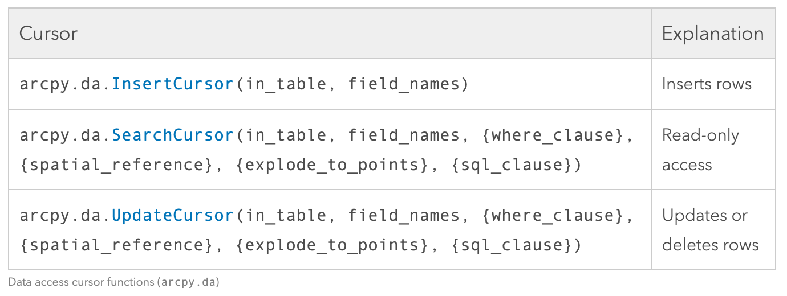

# GEOG 432/832: Programming, Scripting, and Automation for GIS

#

## Unit 06.01: Cursors and searching data

### Dr. Bitterman

#

--- 

# Today's schedule

- Open discussion
- Slides, discussion and exercises
- For next class

---

# Open discussion

### How's lab 2 going?

---


# Reading records

- ```arcpy.ListFields()``` reads **columns**, but how should we read records (rows?)

- We use objects called "cursors" (3 types)

---

# The big picture

- Insert cursor: inserts rows to the table (adds new values)
- Search cursor: retrieves rows (reads existing values)
- Update cursor: updates AND deletes rows (modifies existing values)

---
# Documentation



---

# The search cursor

- Read-only object that iterates over records (both tabular and geometry) in a feature class
1. Set up a loop that will iterate through the rows until there are no more available to read
2. Within the loop, do something with the values in the current row.

---

# Search cursor syntax

```python
arcpy.da.SearchCursor(in_table, field_names, {where_clause}, 
                      {spatial_reference}, {explode_to_points} 
                      {sql_clause}) #note, your book is wrong here

```
- in_table: the table (feature class) you'll be searching
- field_names: list (or tuple) of field names
- {where_clause}: expression that limits the records returned
- {spatial_reference}: if specified,  feature will be projected (or transformed) from the input's spatial reference
- **{explode_to_points}**: deconstruct feature into its individual points or vertices (Boolean)
- {sql_clause}: a SQL (structured query language) search clause

---

# Let's try it!

---

# Setup

1. Start a new ArcGIS Pro project
2. Download "week06inclass.zip" from GitHub repository
3. Extract the data to your new project's directory
4. Add the single shapefile to your project. What is it?
5. Start a new Python notebook in ArcGIS Pro, list the fields in the feature class
6. Using your skills from last week, write a script (with a loop) that simultaneously prints each field's *name* and *type*

## WAIT!!!!!

---

# Our very first cursor

We're going to setup a SearchCursor to interrogate the dataset

### Let's start with this code... what do we expect it to do?

```python
fc = ".\\path\\to\\file.shp"

cursor = arcpy.da.SearchCursor(fc, "NAME10")
for row in cursor:
    print(row)
```

### What's the output?

---

# SearchCursors return tuples

- What's a tuple?
- How do we subset tuples?

### Let's try it again - how is this different?
```python

cursor = arcpy.da.SearchCursor(fc, "NAME10")
for row in cursor:
    print(row[0])

```
### What happened? How is it different than before?

---

# Some cursor weirdness

- Cursors create locks on the dataset
- If the code crashes or does not complete its work, it sometimes doesn't exit "gracefully"
- This can be managed by creating your cursor a bit differently. You should use a "with" statement

```python
with arcpy.da.SearchCursor(fc,("NAME10")) as cursor:
    for row in cursor:
        print (row[0])
```
- *Note, if you use "with", you must also indent all code beneath the "with"*
## I will use "with" in (most of) my examples

---

# More weirdness

- What if we want to iterate through the rows of the cursor a second time?
- Let's try it (without the "with" this time)

```python

cursor = arcpy.da.SearchCursor(fc, "NAME10")
for row in cursor:
    print(row[0])

print("------- doing it again") # helps us debug
    
for row in cursor:
    print(row[0])

```
### what happened?

---

# You have to reset your cursor - why?

- the second loop never "gets off the ground" because the cursor's internal pointer is still pointing at the last row.  
- We could just re-create the cursor object.  
- or we call on the cursor's reset() method.  For example:

```python
cursor = arcpy.da.SearchCursor(fc, "NAME10")
for row in cursor:
    print(row[0])

print("------- doing it again") # helps us debug
cursor.reset() # this is new
    
for row in cursor:
    print(row[0])
```
### did it work?

---

# Here's our problem:

## How would we calculate the average county population in Nebraska?

## To the whiteboard!!!!!

---

# Let's try this

### Break it down

```python
accumulating_pop = 0
count_of_counties = 0

with arcpy.da.SearchCursor(fc, (["Total"])) as cursor:
    for row in cursor:
        accumulating_pop = accumulating_pop + row[0]
        count_of_counties +=1

print("the average population is: ", accumulating_pop / count_of_counties)

```

### What happened?

---


# We can also specify more than one field in our cursor

### Like this:

```python
with arcpy.da.SearchCursor(fc, ["NAME10", "Total"]) as cursor:
    for row in cursor:
        print (row[0], row[1])
```
### Expectations?

---

# Using SQL

### SQL: "Structured query language"

Three main components:
1. SELECT: What attributes (columns) you are selecting
2. FROM: The table you're selecting from
3. WHERE: The condition you impose on the records (rows)

### A simple example

```
SELECT * FROM 'my_table' WHERE "Tot_pop < 54254"
```
---

# Here's a SQL example

### Let's break it down

```python
with arcpy.da.SearchCursor(fc, ["NAME10", "Total"], ' "Total" > 256465 ') as cursor:
    for row in cursor:
        print(row[0], row[1])
```

### What happened?

---

# See your textbook (Chapter 8) for more SQL examples and fancier syntax

---

# Paired in-class practice

### Task 1: Using a search cursor, figure out the **NAME** of the county with the highest population AND the population value

##

### Task 2: Using a search cursor, calculate the average population *density* across Nebraska counties in units of: **Females age 50-54 per unit area**

### Then repeat Task 2, but only in counties with fewer than 15,000 residents

---

# For next class

- Lab 2 is due Wednesday
- Read Chapter 8 this week