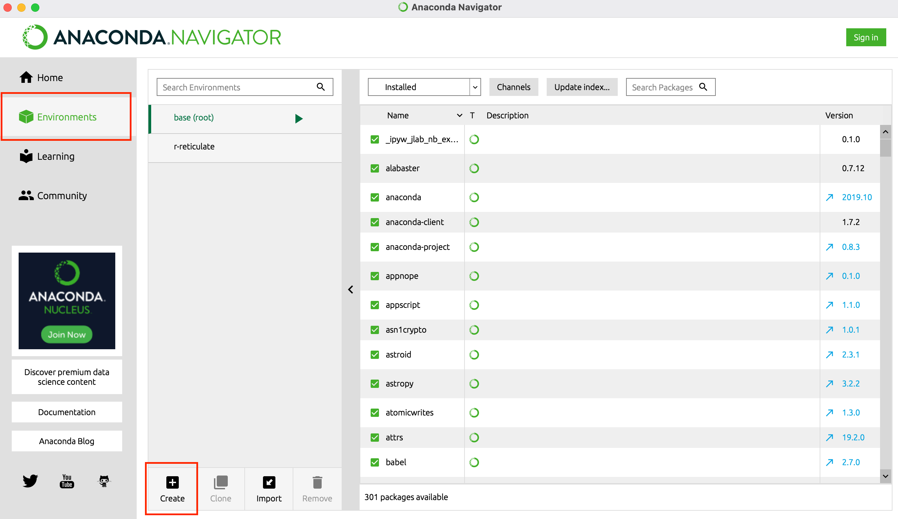
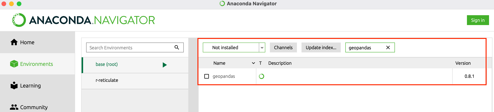
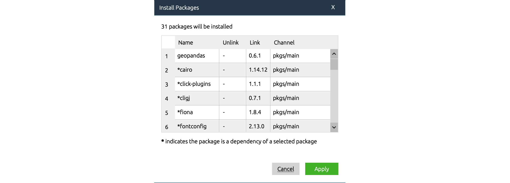
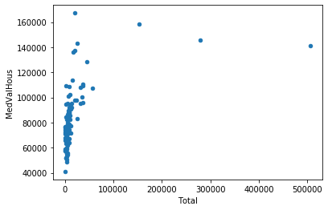

# GEOG 432/832: Programming, Scripting, and Automation for GIS

#

## Week 10.01: Geographic data science and tools

### Dr. Bitterman

#

--- 

# Today's schedule

- Open discussion
- Slides, discussion and exercises
- For next class

---

# Open discussion

---

# The second half of this course

- Bye, bye ArcPy
- Readings: 
    - posted to Canvas 
    - from: Geographic Data Science with PySAL and the PyData Stack (https://geographicdata.science/book/intro.html)
- In class work: in Jupyter notebooks via Anaconda (but not in ArcGIS)
- Your "at home" work: notebooks preferred, but .py scripts ok too
- 4 labs remaining:
    - Shorter in length
    - But each is due in just 6 days (but you don't need to come to the lab)
    - **100% open source**

---

# Today's prep:

- We'll use *week10inclass.zip* from course repository
- Open Anaconda
- Wait

---

# Challenges in a group computing environment
- We don't have individual admin-level access
- Warning: some workarounds required (they are NOT required on your personal machines)
- Process:
    1. Create a new environment
    2. Install packages
    3. Install Jupyter Notebook to the environment
    4. Finally do some work 

---

# Anaconda


---

# Creating a new environment


---

# Searching for and installing packages



---

# The "brilliance" of package managers

##




---

# Setting up our new environment

1. Create a new environment - name it something sensible (e.g., "geog432")
2. Install packages
    - geopandas
    - seaborn
    - numpy (numpy-base)
    - matplotlib
3. Launch Jupyter notebook (with your new environment selected)

---


# Some GIScience

---

## Geographic processes are represented using objects, fields, and networks

- **Objects**: discrete entities that occupy a specific position in space and time
- **Fields**: continuous surfaces that could be measured at any location in space and time
- **Networks**: set of connections between *objects* or between positions in a *field*

---

# Some standard data structures

- a few key standards:
    - around for a long time
    - proven to be useful 

- In this course: 
    - geographic tables
    - surfaces
    - spatial graphs

## *have we seen any of these already?*

---

# Geographic tables

- store information about discrete objects
- two dimensional structures: rows & columns
- each row represents an independent object (or feature)
- each column stores an attribute of those objects

### "Geographic tables" are (sort of) special
- one column stores geographic information
- combindes geographic and non-geographic information
- examples: 
    - PostGIS tables (as a geographic extension of PostgreSQL)
    - R’s sf data frames 
    - Python’s GeoDataFrame objects, provided by *geopandas*

---

# Surfaces

- Fields: continuous representation of space (theoretically an infinite set of locations)
- In practice: measured at a discrete set of locations
- In practice: recorded and stored in uniform grids or *arrays*

- Arrays are matrices
    - at least two dimensions
- **Surface arrays:** 
    - rows and columns signify location
    - cell values to store information about that location

### *Similarities to other data structures?*

---

# Graphs (networks)

- capture relations relationships between objects that are mediated through space
- Essentially geographic networks
- Store topologies 

Examples: 
- spatial weights matrices
- adjacency matrices
- spatial networks

---

# Let's do some work

---

# Setup

```python
%matplotlib inline     # Ensures visualizations are plotted inside the notebook

import os              # Provides several system utilities
import pandas as pd    # Workhorse of data munging in Python
import geopandas       # The framework for geospatial data tables in Python
import seaborn as sns  # Allows us to efficiently and beautifully plot
```
- Comments are useful
- What does **"as"** do?

---
# Reading some data:

### Break it down FIRST
1. What does each line do? 
    1. What functions?
    2. Parameters?
2. What assumptions does the code make about how we've organized our data?

```python
# Read table
print(os.getcwd())
d = pd.read_csv("./week10inclass/ne_counties_census.csv", index_col='GEOID')
```

---

# Displaying our data:

```python
d    #simplest slide EVER!!! 
```

### What happened?

---

# This is a DataFrame

- two dimensions: rows and columns
- each row and column is assigned an *index* (displayed in bold) 
    - column indexes: generated from the .csv file’s column names
    - row indexes: specified when reading the file (**GEOID** in our case)

- VERY usefully, DataFrames (can) contain columns with different *types* of data


---

# Some simple work with DataFrames

```python
d.head() # Prints the first n records

d.tail() # Prints the last n records

d.info() # Prints an overview of the DataFarme

d.columns # all the column names (how is this different?)

for x in d.columns:
    print(x)

```
### Give it a shot!

---
# Further interrogation of our data

```python

d.describe() # summary stats for the attributes

d.describe().T # Transposes the summary stats

```
---

# Even more stats

```python
d.max() # the maximum value of each column
maxes = d.max() # assign it to a variable of its own

d.min() # minimums

d.std() # standard deviations
```
### Note: not all make sense!

---

# Rows and columns

### Get just one column
```python
# get one column
d['PerCapInc']

# or just the maximum of one column
d['PerCapInc'].max()

```

### Grabbing just one row

```python
d.loc[31059]
```

### One row, one column:
```python
d.loc[31059]['PerCapInc']
```

---

# We can also create new variables

### Population of men in their 40s
```python
m40s = d['M40to44Y'] + d['M45to49Y']
m40s
```

### Add it back to the table
```python
d['M40s'] = m40s
```

### Or just do it "in place"
```python
d['M40s'] = d['M40to44Y'] + d['M45to49Y']
```
---

# Delete the field

```python
del d['M40s']
```

---

# Conditional searches

### A quick search
```python
lowpops = d.loc[d['Total'] < 25000, :]
lowpops
```


### Direct queries

```python
d.query("(Total < 2000) & (Vacant / TotalUnits > .2)")
```

---

# Some quick visulizations with histograms

### Seaborn
```python
sns.distplot(d['Total'], kde=False)
```

### pandas
```python
d.hist('Total') # calls matplotlib for the histogram
```

### matplotlib (explicitly)
```python
import matplotlib
matplotlib.pyplot.hist(d['Total'])
```
---

# Or a scatterplot
```python
d.plot.scatter('Total', 'MedValHous')
```
###



---


# For next class

- Lab 5 is availalbe, but not due for 2 weeks
- Readings are linked/posted on Canvas
- For more, look at: https://darribas.org/gds_course/content/bB/lab_B.html (used as a basis of today's examples)