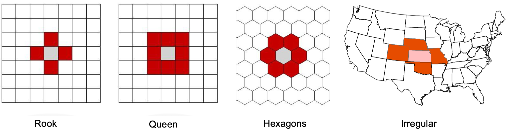
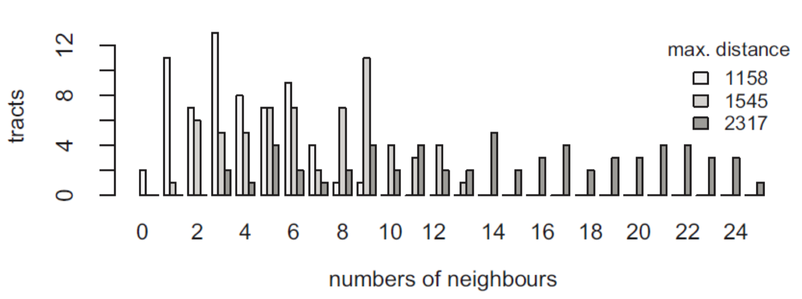

# GEOG 432/832: Programming, Scripting, and Automation for GIS

#

## Week 12.01: Formalizations of space and spatial relationships

### Dr. Bitterman

#

--- 

# Today's schedule

- Open discussion
- Slides and discussion - more lecture than normal
- In-class exercises
- For next class

---

# Open discussion

---

# Today is about formalization

* Why?
* But also, WHY???
* Formalizing spatial relationships is foundational
    * "Global" spatial autocorrelation
    * Local spatial autocorrelation metrics
    * Spatial clustering
    * Hot spots/cold spots

---

# Tobler's first law of Geography

* Everything is related to everything else, but nearer things are more related than farther (or something like that)

* Formally, *spatial autocorrelation* <-- what does it mean for a variable to be "autocorrelated"?

---

## % white residents, 2010 Census


---

# Relevant questions

- Which areas are unusual?
- Which areas are important?
- Are there “hotspots” of some phenomena?
## 
- How much influence do neighbors have?
- How should we measure/conceptualize “neighbors”?
- Implications of our choices?


---

# Spatial context matters

- For a statistical method to be explicitly spatial, it needs to contain some representation of the geographic space, topological relationships, or spatial context

- One of the most common ways is through *spatial weights matrices*

---

# Some formalization processes

- **(Geo)Visualization**: translating numbers into a (visual) language that the human brain “speaks better”

- **Spatial Weights Matrices**: translating geography into a (numerical) language that a computer “speaks better”

---

# Spatial weights matrices

Core element in several spatial analysis techniques:

- Spatial autocorrelation
- Spatial clustering / geodemographics 
- Spatial regression

---

# Formalization

## *W* as a formal representation of spatial relationships
### (i.e., a spatial weights matrix)

---

# *W* (the spatial weights matrix)

- *N x N positive matrix* that contains **spatial relations** between all the observations in the sample 

- FORMALLY, w<sub>ij</sub>... the *weight* from zone *i* to zone *j*

- Core concept in statistical analysis of areal data

- Two steps involved:
    - define which relationships between observations are to be given a non-zero weight, i.e., define spatial neighbors
    - assign weights to the neighbors

*w<sub>ii</sub>* = 0 (by convention)

### *...what is a neighbor?*

---

# How would you define a "neighbor"?

- Assigning neighbors and weights is not easy as it seems to be

- Which states are near Nebraska?

---


--- 

# What IS a neighbor?

A neighbor is “somebody” who is:
- Next door → **Contiguity**-based Ws
- Close → **Distance**-based Ws
- In the same “place” as us → **Block** weights

---

# Spatial neighbors

### Contiguity-based neighbors

- Zone i and j are neighbors if zone i is contiguous or adjacent to zone j
- But what constitutes contiguity?

### Distance-based neighbors

- Zone i and j are neighbors if the distance between them are less than the threshold distance
- But what distance do we use?

### Block weights (not in this course)

- Weights are assigned based on discretionary rules loosely related to geography
- Census blocks into Census tracts


---


# Choice of W

- Should be based on and reflect the underlying patterns of interaction for the question at hand. Examples:
    - Processes propagated by immediate contact (e.g. disease contagion) → Contiguity weights 
    - Accessibility → Distance weights
    - Effects of county differences in laws → Block weights


---

# Contiguity-based Spatial Neighbors



---

# Example


---

# Higher-order contiguity


---

# Distance-based neighbors

- How do we measure distance between polygons?
- Distance metrics
    - 2D Cartesian distance (projected data)
    - 3D spherical distance/great-circle distance (lat/long data)

- *But where do we measure from?*
- *Any implications of our choices?*


---

# Distance-based neighbors (k-nearest)


---

# Distance-based neighbors (threshold distance)


---

# Connectivity histogram



---

# A simple spatial weights matrix


---

# Decay functions of distance

- Most common choice is the inverse (reciprocal) of the distance between locations *i* and I 
- Other common functions:
    - inverse of squared distance 
    - negative exponential 


---


# Standardization

- In some applications (e.g. spatial autocorrelation) it is common to standardize *W*
- The most widely used standardization is row-based: divide every element by the sum of the row

---


# Paired programming exercise:
## Building spatial weights matrices

---


# Building spatial weights matrices

### Today's prep:

```python
%matplotlib inline

import seaborn as sns
import pandas as pd
from libpysal import weights
from libpysal.io import open as psopen
import geopandas as gpd
import numpy as np
import matplotlib.pyplot as plt

```
## Verify all packages are in your environment

---

# Resources from GitHub
- *week12_in_class.ipynb*
- *week12inclass.zip* 

---

# Contiguity

- Common boundaries: if two polygons share boundaries to some degree, they will be labeled as neighbors under these kinds of weights
    - **Queen**: only need to share a vertex (a common POINT)
    - **Rook**: share a vertex AND a line segment
- Depending on the level of irregularity, queen and rook contiguity matrices may be *very* similar (if not identical)


---

# Spatial lag (can be confusing)

### *Formally...*

The product of a spatial weights matrix *W* and a given variable *y*

Wy<sub>i</sub> = $\sum$ w<sub>ij</sub>y<sub>j</sub>

---

# more generally:

- Measure that captures the behavior of a variable in the neighborhood of a given observation *i*

- If *W* is standardized, the spatial lag is the average value of the variable in the neighborhood of *i*

- Common notation: the spatial lag of *y* is expressed as *W<sub>y</sub>*

- With a neighbor structure defined by the non-zero elements of the spatial weights matrix W, a spatially lagged variable is a weighted sum or a weighted average of the neighboring values for that variable


---

# Back to the formalization

The product of a spatial weights matrix *W* and a given variable *y*

Wy<sub>i</sub> = $\sum$ w<sub>ij</sub>y<sub>ij</sub>

## This allows us to compare the value of y to W<sub>y</sub>

### or in other words, the value of the feature to the weighted average of the feature's neighbors


---

# Still confused? This of it this way:

## How different is the per capita income of Lancaster County to its neighbors?

Assumes we have formalized a neighborhood (*W*) and weighted those neighborhood relationships


---

# Moran plot

A standardized Moran Plot also partitions the space into four quadrants that represent different situations:

1. High-High (HH): high values above average surrounded by values above average

2. Low-Low (LL): low values below average surrounded by values below average

3. High-Low (HL): high values above average surrounded by values below average

4. Low-High (LH): low values below average surrounded by values above average

---

# More about Moran

- A standardized Moran Plot implies that average values are centered in the plot (as they are zero when standardized) and dispersion is expressed in standard deviations

- General rule: values greater or smaller than two standard deviations are considered *outliers*

---


---

# Try it in the notebook with your partner!

---

# For next class

- Readings are linked/posted on Canvas... BE SURE TO DO IT THIS WEEK
