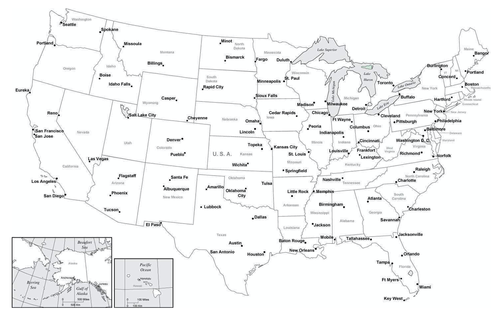
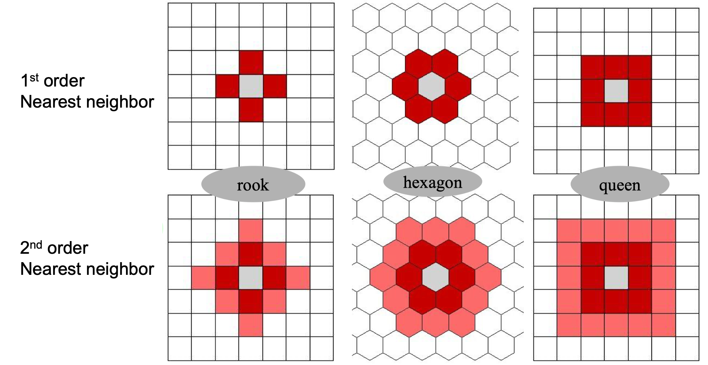
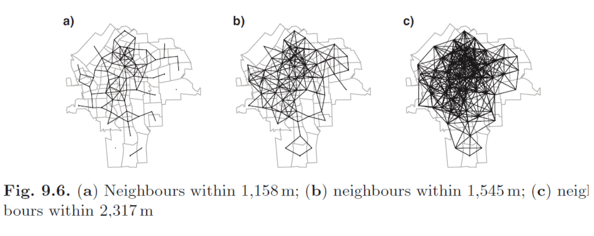

# GEOG 432/832: Programming, Scripting, and Automation for GIS

#

## Week 12.01: Formalizations of space and spatial relationships

### Dr. Bitterman

#

--- 

# Today's schedule

- Open discussion
- Slides and discussion - more lecture than normal
- For next class
- Open work time (if there is any)

---

# Open discussion

---

# Today is about formalization

* Why?
* But also, WHY???
* Formalizing spatial relationships is foundational
    * "Global" spatial autocorrelation
    * Local spatial autocorrelation metrics
    * Spatial clustering
    * Hot spots/cold spots

---

# Tobler's first law of Geography

* Everything is related to everything else, but nearer things are more related than farther (or something like that)

* Formally, *spatial autocorrelation*

---

## Spatial autocorrelation of areal units (% white, 2010 Census)

---

# Relevant questions

- Which areas are important?
- Which areas are unusual?
- Are there “hotspots” of some phenomena?
- How much influence do neighbors have?
- How should we measure/ conceptualize “neighbors”?
- Implications of our choices?

---

# Spatial context matters

- For a statistical method to be explicitly spatial, it needs to contain some representation of the geography, or spatial context

- One of the most common ways is through *spatial weights matrices*

---

# Formalizing processes

- **(Geo)Visualization**: translating numbers into a (visual) language that the human brain “speaks better”

- **Spatial Weights Matrices**: translating geography into a (numerical) language that a computer “speaks better”

---

# Spatial weights matrices

Core element in several spatial analysis techniques:

- Spatial autocorrelation
- Spatial clustering / geodemographics 
- Spatial regression

---

# Formalization

*W* as a formal representation of space

---

# *W* (the spatial weights matrix)

- *N x N positive matrix* that contains **spatial relations** between all the observations in the sample 

- FORMALLY, wij... the weight from zone *i* to zone *j*

- Core concept in statistical analysis of areal data

- Two steps involved:
    - define which relationships between observations are to be given a nonzero weight, i.e., define spatial neighbors
    - assign weights to the neighbors

*wii* = 0 (by convention)

### *...what is a neighbor?*

---

# How would you define a "neighbor"?

- Making the neighbors and weights is not easy as it seems to be

- Which states are near Nebraska?

---

--- 

# What IS a neighbor?

A neighbor is “somebody” who is:
- Next door → **Contiguity**-based Ws
- Close → **Distance**-based Ws
- In the same “place” as us → **Block** weights

---

# Spatial neighbors

### Contiguity-based neighbors

- Zone i and j are neighbors if zone i is contiguity or adjacent to zone j
- But what constitutes contiguity?

### Distance-based neighbors

- Zone i and j are neighbors if the distance between them are less than the threshold distance
- But what distance do we use?

### Block weights

- Weights are assigned based on discretionary rules loosely related to geography
- Census blocks into Census tracts

---

# Choice of W

- Should be based on and reflect the underlying channels of interaction for the question at hand. Examples:
    - Processes propagated by inmediate contact (e.g. disease contagion) → Contiguity weights 
    - Accessibility → Distance weights
    - Effects of county differences in laws → Block weights

---

# Contiguity-based Spatial Neighbors

---

# Example

---

# Higher-order contiguity

---

# Distance-based neighbors

- How do we measure distance between polygons?
- Distance metrics
    - 2D Cartesian distance (projected data)
    - 3D spherical distance/great-circle distance (lat/long data)

- *But where do we measure from?*
- *Any implications of our choices?*

---

# Distance-based neighbors (k-nearest)

---

# Distance-based neighbors (threshold distance)

---

# Connectivity histogram

---

# A simple spatial weights matrix

---

# Decay functions of distance

- Most common choice is the inverse (reciprocal) of the distance between locations i and j 
- Other functions also used
    - inverse of squared distance 
    - Or negative exponential 

---

# Standardization

- In some applications (e.g. spatial autocorrelation) it is common to standardize W
- The most widely used standardization is row-based: divide every element by the sum of the row

---

# For next class

- Readings are linked/posted on Canvas... BE SURE TO DO IT THIS WEEK
