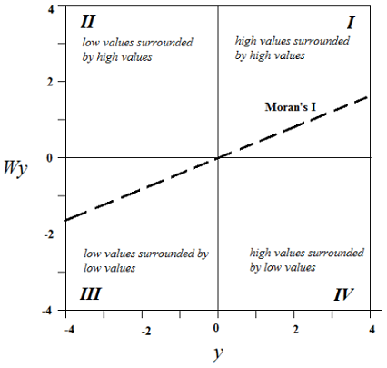

# GEOG 432/832: Programming, Scripting, and Automation for GIS

#

## Week 12.02: Spatial weights matrices

### Dr. Bitterman

#

--- 

# Today's schedule

- Open discussion
- Slides, discussion, and exercises
- For next class

---

# Open discussion

---

# Building spatial weights matrices

### Today's prep:

```python
%matplotlib inline

import seaborn as sns
import pandas as pd
from libpysal import weights
from libpysal.io import open as psopen
import geopandas as gpd
import numpy as np
import matplotlib.pyplot as plt

```
## Verify all packages are in your environment

---

# We'll be flipping back and forth from slides to notebook

## download from Canvas
- *unit11_in_class.ipynb*
- *unit11data.zip*


---

# Contiguity

- Common boundaries: if two polygons share boundaries to some degree, they will be labeled as neighbors under these kinds of weights
    - **Queen**: only need to share a vertex (a common POINT)
    - **Rook**: share a vertex AND a line segment
- Depending on the level of irregularity, queen and rooks contiguity may be *very* similar (if not identical)


---

# Notebook demo

---

# Spatial lag (can be confusing)

### *Formally...*

The product of a spatial weights matrix *W* and a given variable *y*

Wy<sub>i</sub> = $\sum$ w<sub>ij</sub>y<sub>ij</sub>

---

# more generally:

- Measure that captures the behaviour of a variable in the neighborhood of a given observation *i*

- If *W* is standardized, the spatial lag is the average value of the variable in the neighborhood of *i*

- Common notation: the spatial lag of *y* is expressed as *W<sub>y</sub>*

- With a neighbor structure defined by the non-zero elements of the spatial weights matrix W, a spatially lagged variable is a weighted sum or a weighted average of the neighboring values for that variable


---

# Back to the formalization

The product of a spatial weights matrix *W* and a given variable *y*

Wy<sub>i</sub> = $\sum$ w<sub>ij</sub>y<sub>ij</sub>


---

# Let's calculate it (back to the notebook)

---

# Moran plot

A standardized Moran Plot also partitions the space into four quadrants that represent different situations:

1. High-High (HH): high values above average surrounded by values above average

2. Low-Low (LL): low values below average surrounded by values below average

3. High-Low (HL): high values above average surrounded by values below average

4. Low-High (LH): low values below average surrounded by values above average

---

# More about Moran

- A standardized Moran Plot implies that average values are centered in the plot (as they are zero when standardized) and dispersion is expressed in standard deviations

- General rule: values greater or smaller than two standard deviations are considered *outliers*

---



---


# For next class

- Lab 6 due April 8th
- Lab 7 starts Friday - I WILL NOT BE HERE FRIDAY
- Readings are linked/posted on Canvas... BE SURE TO DO IT THIS WEEK
