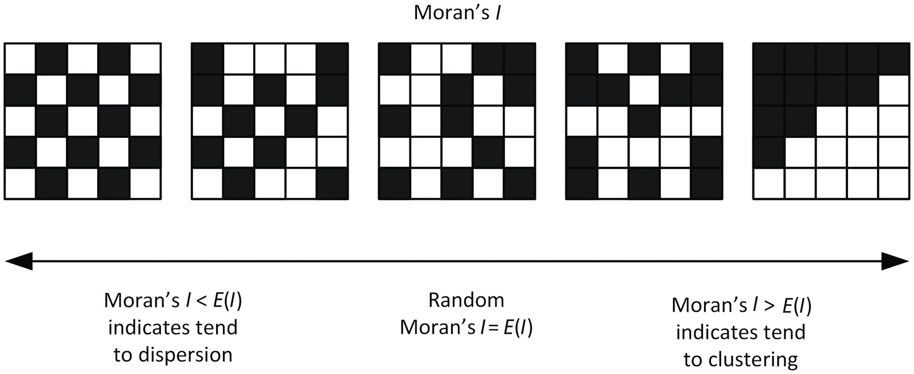
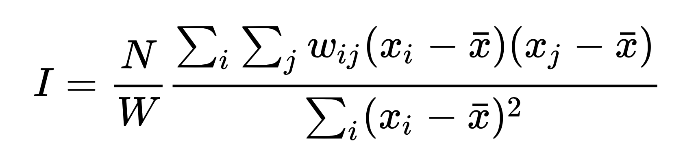

# GEOG 432/832: Programming, Scripting, and Automation for GIS

#

## Week 13.01: ESDA and spatial autocorrelation

### Dr. Bitterman

#

--- 

# Today's schedule

- Open discussion
- Slides, discussion, and exercises
- For next class

---

# Open discussion

---

# Building spatial weights matrices

### Today's prep:

```python
%matplotlib inline

import seaborn as sns
import pandas as pd
from libpysal import weights
from libpysal.io import open as psopen
import geopandas as gpd
import numpy as np
import matplotlib.pyplot as plt
```
## Verify all packages are in your environment

---

# What's ESDA again?

---

## Exploratory

###

## Spatial

###

## Data

###

## Analaysis

---

# Exploratory

- Focus on *discovery*
- No assumptions (or limited assumptions)
- Purpose: learn something about your data

---

# Spatial

- Investigate patterns/processes with an emphasis on *geography* and *spatial relations*

---

# Data analysis

- Descriptive analysis 

- Statistical techniques

- Visualization

---

# Questions that ESDA helps answer:

- Is the variable I’m looking at concentrated over space? Do similar values tend to locate closeby?

- Can I identify any particular areas where certain values are clustered?

## Deeper:

- What is the causal process that generate this pattern?

- Why do we observe spatial clusters?

- Do any spatial outliers exist?

---

# Spatial autocorrelation

- Statistical representation of Tobler's 1st law

- It's like traditional correlation... but spatial! ...and self-referenced

*Degree to which similar values are located in similar regions*

## Two types:

- Positive: similar values in a similar location *(close by)*

- Negative: similar values in dissimilar locations *(farther apart)*

---


source: https://mgimond.github.io/Spatial/spatial-autocorrelation.html

---



---

# Examples?

## Positive?

###

## Negative?

---

# Examples?

### Positive?

- income

- vegetation

- elevation

- temperature

### Negative?

- Fire stations

- Hospitals

- Supermarkets

---

# Scales of spatial autocorrelations

- "Global": 
    - *Clustering* -> do values tend to be close to other (dis)similar values?
    - Descibes the whole study area

- "Local":
    - *Clusters* -> are there any specific parts of a map with an extraordinary concentration of (dis)similar values?
    - Hotspots, coldspots, spatial outliers

---

# Global spatial autocorrelation

## Remember the Moran plot?

### And what's "spatial lag" again?


---

# Moran plot


---

# Moran's I



where *N* is the number of spatial units indexed by i and j
*x* is the variable of interest
*x̅* is the mean of x
*w<sub>ij</sub>* is a matrix of spatial weights with zeroes on the diagonal
*W* is the sum of all w<sub>ij</sub>

---

# Perhaps more simply (conceptually, at least)


## The slope of the best fit line in the Moran plot

---

# Local spatial autocorrelation

"Clusters", or *pockets of spatial instability*

Portions of a map where values are correlated in a particularly strong and specific way

* High-High + SA of *high* values (*hotspots*) 

* Low-Low + SA of *low* values (*coldspots*) 

* High-Low - SA (*spatial outliers*) 

* Low-High - SA (*spatial outliers*)

---

# LISAs

- Local Indicators of Spatial Association

- Statistical tests for spatial cluster detection → Statistical significance

- Compares the observed map with many randomly generated ones to see how likely it is to obtain the observed associations for each location


---

# Let's try something in the time we have left

- download *week13data.zip* from GitHub repository
- What does it contain?


---

# How we got here

- Started with the *Counties* geodatabase from: https://www.census.gov/geographies/mapping-files/2010/geo/tiger-data.html
- FAR too many columns to fit in a shapefile
- So I trimmed it down for the purposes of this class


---

# Your job(s)... as a group?:

- Read the file
- Choose a reasonable index column
- Find the Median Income attribute (column)... HOW???
- Visualize it
- Create a weights matrix based on a *reasonable* conceptualization of a neighborhood. How do you know what's *reasonable*?

### We'll finish the spatial autocorrelation work next class

--- 

# For next class

- Lab 6 due this week
- Lab 7 starts Thursday
- Readings are linked/posted on Canvas...
