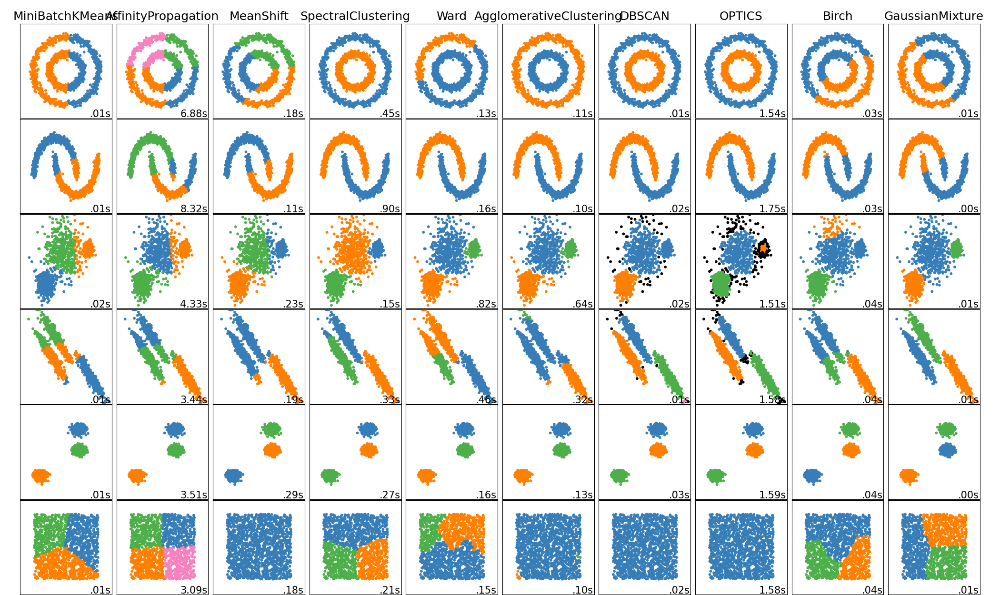

# GEOG 432/832: Programming, Scripting, and Automation for GIS

#

## Week 15.01: Clustering

### Dr. Bitterman

#

--- 

# Today's schedule

- Open discussion
- Slides, discussion, and exercises
- For next class

---

# Open discussion


---


# Today's prep

Download *week15_inclass.ipynb* and *week15inclass.zip* from GitHub repository

---

# Today's prep:

```python
%matplotlib inline

import seaborn as sns
import pandas as pd
import geopandas as gpd
import numpy as np
import matplotlib.pyplot as plt
# new ones below
from sklearn import cluster # note the difference
import contextily as cx
```
## Verify all packages are in your environment

## ...and that you're in the correct environment

## ...can you find them all???

---

# Alternative sources

Not all packages are in the default channel (like *contextily*, depending on your version of Anaconda)

### Let's add one

1. While selecting the correct environment, click on "Channels", then "Add..."

2. in the new box, type the URL of conda-forge: ```https://conda.anaconda.org/conda-forge/```

3. Press "Enter" to add

4. Update index (or now, indices)

5. Add *contexily* to your environment

---

# Today we'll be tackling clustering

### What's a cluster???


---

# Background

### Real world is complex

- non-linear
- uncertain
- multivariate (as opposed to univariate...)


---

# Tackling multivariate data

- Can be difficult to "look at" more than a few variables simultaneously

- Often necessary to *reduce dimensionality*

- Many techniques don't require preliminary assumptions about data structure

- Also useful as an exploratory tool

---

# Statistical clustering

- **Basic idea:** summarize the multivariate data by creating a (relatively) small number of classes 

- Each observation is assigned to one (and only one) class, depending on its position in multidimensional space

- MANY, MANY, MANY techniques to statistically group observations

- Common thread: define classes or categories of observations that are similar within each of them, but differ between groups

---

# But implementation details differ

- How "similarity" and "dissimilarity" are defined differs among algorithms

- Applications and utility depend on problem set


---



---

# K-means

- A (very) common statistical clustering technique
- anyone familiar???

## Whiteboard demo

(also: https://stanford.edu/~cpiech/cs221/handouts/kmeans.html)

---

# What are some big assumptions?

## (and/or required parameters)

---

# Interactive session (Jupyter notebook)

---

# For next class

- Lab 7 due Wednesday
- Lab 8 starts Thursday
- Readings are linked/posted on Canvas...

